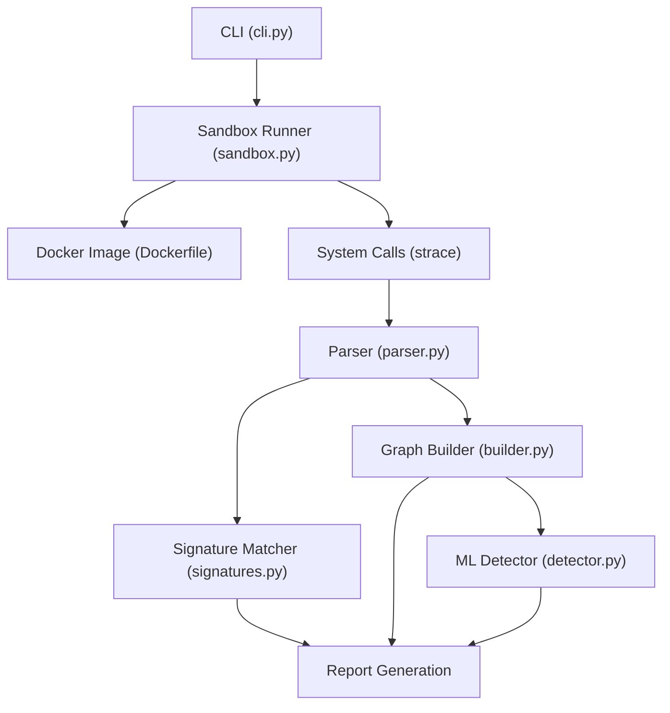
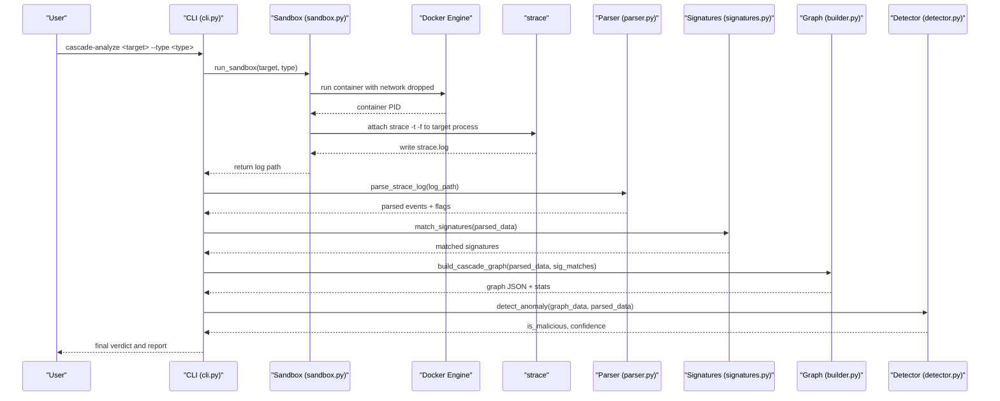
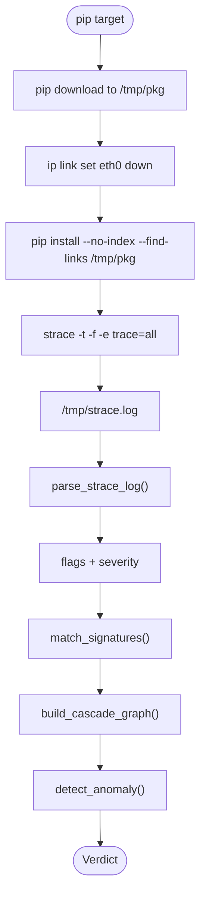
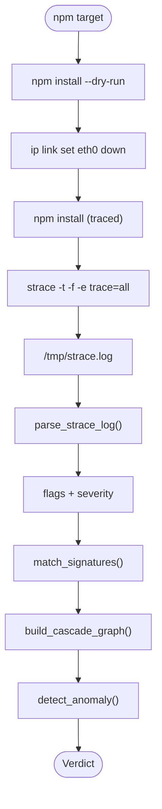
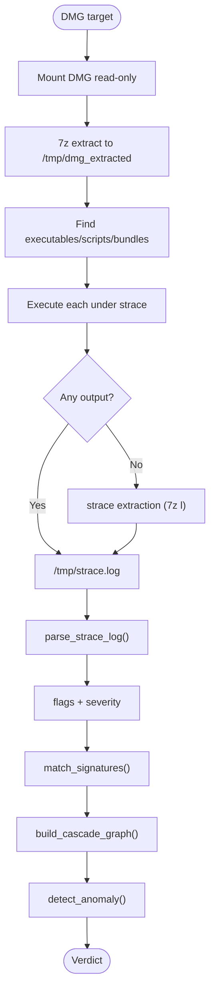
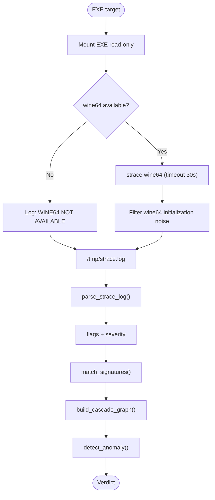
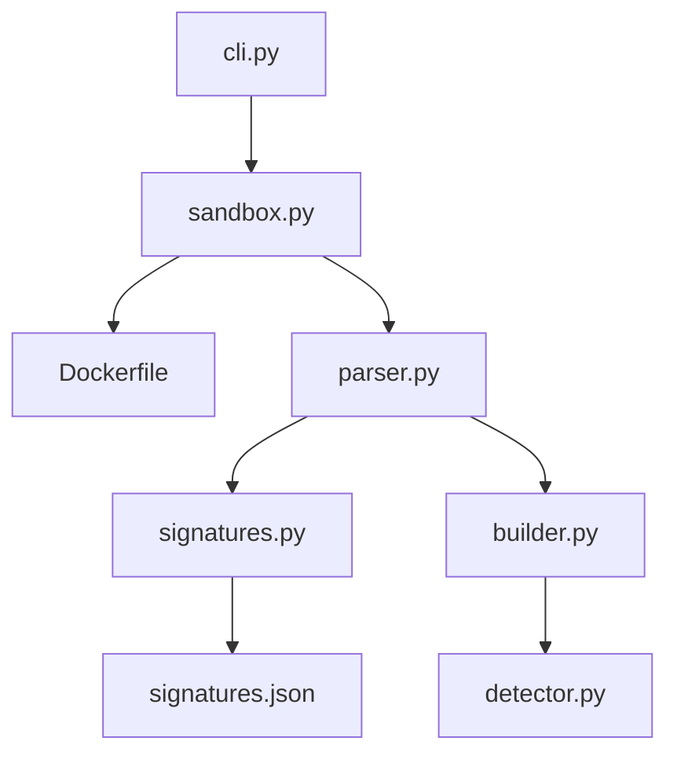

# Target Type Analysis

<cite>
**Referenced Files in This Document**
- [cli.py](file://TraceTree/cli.py)
- [sandbox.py](file://TraceTree/sandbox/sandbox.py)
- [Dockerfile](file://TraceTree/sandbox/Dockerfile)
- [parser.py](file://TraceTree/monitor/parser.py)
- [signatures.py](file://TraceTree/monitor/signatures.py)
- [signatures.json](file://TraceTree/data/signatures.json)
- [builder.py](file://TraceTree/graph/builder.py)
- [detector.py](file://TraceTree/ml/detector.py)
- [README.md](file://TraceTree/README.md)
</cite>

## Table of Contents
1. [Introduction](#introduction)
2. [Project Structure](#project-structure)
3. [Core Components](#core-components)
4. [Architecture Overview](#architecture-overview)
5. [Detailed Component Analysis](#detailed-component-analysis)
6. [Dependency Analysis](#dependency-analysis)
7. [Performance Considerations](#performance-considerations)
8. [Troubleshooting Guide](#troubleshooting-guide)
9. [Conclusion](#conclusion)

## Introduction
This document explains TraceTree’s target type analysis capabilities for four supported targets: Python packages (pip), npm packages, DMG files, and Windows EXE files. It details the sandbox execution environment, system call tracing methodology, and behavioral pattern detection. For each target type, it covers the unique analysis approach, sandbox configuration, and how the system interprets results.

## Project Structure
TraceTree orchestrates a multi-stage pipeline:
- Target selection and orchestration via the CLI
- Sandbox execution with Docker and strace
- System call parsing and behavioral signature matching
- Graph construction and machine learning-based anomaly detection

**Diagram sources**
- [cli.py:181-259](file://TraceTree/cli.py#L181-L259)
- [sandbox.py:175-335](file://TraceTree/sandbox/sandbox.py#L175-L335)
- [Dockerfile:1-11](file://TraceTree/sandbox/Dockerfile#L1-L11)
- [parser.py:340-679](file://TraceTree/monitor/parser.py#L340-L679)
- [signatures.py:86-115](file://TraceTree/monitor/signatures.py#L86-L115)
- [builder.py:8-195](file://TraceTree/graph/builder.py#L8-L195)
- [detector.py:235-299](file://TraceTree/ml/detector.py#L235-L299)

**Section sources**
- [cli.py:181-259](file://TraceTree/cli.py#L181-L259)
- [README.md:95-103](file://TraceTree/README.md#L95-L103)

## Core Components
- Sandbox runner: Executes targets in a Docker container with network dropped, traces syscalls with strace, and returns a log file path.
- Parser: Reassembles multi-line strace output, extracts events, classifies destinations, and assigns severity weights.
- Signature matcher: Applies behavioral patterns from data/signatures.json to detected events.
- Graph builder: Constructs a NetworkX graph with process, file, and network nodes and temporal edges.
- ML detector: Uses a trained model or a baseline IsolationForest to compute anomaly confidence, adjusted by severity and temporal patterns.

**Section sources**
- [sandbox.py:175-335](file://TraceTree/sandbox/sandbox.py#L175-L335)
- [parser.py:340-679](file://TraceTree/monitor/parser.py#L340-L679)
- [signatures.py:86-115](file://TraceTree/monitor/signatures.py#L86-L115)
- [builder.py:8-195](file://TraceTree/graph/builder.py#L8-L195)
- [detector.py:235-299](file://TraceTree/ml/detector.py#L235-L299)

## Architecture Overview
The pipeline executes each target in a controlled environment, capturing system calls and transforming them into actionable insights.

**Diagram sources**
- [cli.py:181-259](file://TraceTree/cli.py#L181-L259)
- [sandbox.py:175-335](file://TraceTree/sandbox/sandbox.py#L175-L335)
- [parser.py:340-679](file://TraceTree/monitor/parser.py#L340-L679)
- [signatures.py:86-115](file://TraceTree/monitor/signatures.py#L86-L115)
- [builder.py:8-195](file://TraceTree/graph/builder.py#L8-L195)
- [detector.py:235-299](file://TraceTree/ml/detector.py#L235-L299)

## Detailed Component Analysis

### Python Packages (pip)
- Approach: Download the package (with network), then install offline under strace. Network is dropped before install to capture outbound attempts while blocking them.
- Sandbox execution: Uses pip download to fetch wheels into a temporary directory, then pip install --no-index with strace tracing the entire process tree.
- System call tracing: strace -t -f -e trace=all with timestamps and full child process tracing.
- Behavioral pattern detection: Parser flags suspicious connections (e.g., cloud metadata endpoints), sensitive file access, and unexpected process execution. Signature matcher applies patterns like credential theft and reverse shell.
- Target-specific configuration:
  - Network: Dropped before install via ip link set eth0 down.
  - Timeout: 60 seconds.
  - Log filtering: None specific to pip; relies on parser and signature matching.
- Limitations:
  - The sandbox runs on Linux inside Docker; native macOS/Windows syscalls cannot be traced.
  - Some malicious behavior may not surface if it depends on post-install hooks or runtime-only actions.

**Diagram sources**
- [sandbox.py:217-222](file://TraceTree/sandbox/sandbox.py#L217-L222)
- [parser.py:340-679](file://TraceTree/monitor/parser.py#L340-L679)
- [signatures.py:86-115](file://TraceTree/monitor/signatures.py#L86-L115)
- [builder.py:8-195](file://TraceTree/graph/builder.py#L8-L195)
- [detector.py:235-299](file://TraceTree/ml/detector.py#L235-L299)

**Section sources**
- [sandbox.py:217-222](file://TraceTree/sandbox/sandbox.py#L217-L222)
- [README.md:99-102](file://TraceTree/README.md#L99-L102)

### npm Packages
- Approach: npm install under strace with network dropped after a dry-run. Requires Node.js and npm in the sandbox image.
- Sandbox execution: npm install with strace tracing; network is dropped before execution.
- System call tracing: strace -t -f -e trace=all with timestamps and child process tracing.
- Behavioral pattern detection: Same as pip, with parser and signature matcher detecting suspicious network activity and sensitive file access.
- Target-specific configuration:
  - Network: Dropped via ip link set eth0 down.
  - Timeout: 60 seconds.
  - Dry-run: npm install --dry-run used to resolve dependencies before tracing.
- Limitations:
  - Requires Node.js in the sandbox image.
  - npm-specific behavior may differ from native environments.

**Diagram sources**
- [sandbox.py:223-228](file://TraceTree/sandbox/sandbox.py#L223-L228)
- [parser.py:340-679](file://TraceTree/monitor/parser.py#L340-L679)
- [signatures.py:86-115](file://TraceTree/monitor/signatures.py#L86-L115)
- [builder.py:8-195](file://TraceTree/graph/builder.py#L8-L195)
- [detector.py:235-299](file://TraceTree/ml/detector.py#L235-L299)

**Section sources**
- [sandbox.py:223-228](file://TraceTree/sandbox/sandbox.py#L223-L228)
- [README.md:100-102](file://TraceTree/README.md#L100-L102)

### DMG Files
- Approach: Extract DMG with 7z inside the container, locate executables and scripts, execute each under strace, and capture syscall logs. If no executables are found, trace extraction itself.
- Sandbox execution: Mounts the DMG file read-only and runs an analysis script that:
  - Extracts with 7z
  - Discovers .sh, .py, .command, .pkg, .mpkg, .app bundles, and Mach-O binaries
  - Executes scripts and binaries under strace
  - Falls back to tracing extraction if nothing is found
- System call tracing: strace -t -f -e trace=all with timestamps and child process tracing.
- Behavioral pattern detection: Parser and signature matcher apply the same logic as other targets.
- Target-specific configuration:
  - Network: Dropped via ip link set eth0 down.
  - Timeout: 120 seconds for DMG analysis.
  - Extraction: 7z used for broad format support; may fail on encrypted or uncommon formats.
- Limitations:
  - Scripts run in a Linux container; macOS-specific behavior (launchd, Keychain) will not execute.
  - Some DMG formats may require additional tools not included in the sandbox image.

**Diagram sources**
- [sandbox.py:229-243](file://TraceTree/sandbox/sandbox.py#L229-L243)
- [sandbox.py:20-112](file://TraceTree/sandbox/sandbox.py#L20-L112)
- [parser.py:340-679](file://TraceTree/monitor/parser.py#L340-L679)
- [signatures.py:86-115](file://TraceTree/monitor/signatures.py#L86-L115)
- [builder.py:8-195](file://TraceTree/graph/builder.py#L8-L195)
- [detector.py:235-299](file://TraceTree/ml/detector.py#L235-L299)

**Section sources**
- [sandbox.py:229-243](file://TraceTree/sandbox/sandbox.py#L229-L243)
- [sandbox.py:20-112](file://TraceTree/sandbox/sandbox.py#L20-L112)
- [README.md:101-102](file://TraceTree/README.md#L101-L102)

### Windows EXE Files
- Approach: Run Windows EXE under wine64 with strace tracing the full process tree. Wine translates Windows syscalls to Linux syscalls. A 30-second timeout prevents hangs from GUI apps waiting for user input. Wine initialization noise is filtered from the strace log.
- Sandbox execution: Mounts the EXE read-only and runs wine64 under strace with a timeout.
- System call tracing: strace -t -f -e trace=all with timestamps and child process tracing.
- Behavioral pattern detection: Parser and signature matcher apply the same logic as other targets.
- Target-specific configuration:
  - Network: Dropped via ip link set eth0 down.
  - Timeout: 30 seconds for EXE analysis.
  - Noise filtering: Wine initialization noise removed from strace logs.
- Limitations:
  - Wine translation layer means some Windows-specific behavior (registry, COM objects) may not produce visible Linux-level syscalls.
  - GUI applications that wait for user input will timeout after 30 seconds.

**Diagram sources**
- [sandbox.py:237-243](file://TraceTree/sandbox/sandbox.py#L237-L243)
- [sandbox.py:118-168](file://TraceTree/sandbox/sandbox.py#L118-L168)
- [sandbox.py:338-375](file://TraceTree/sandbox/sandbox.py#L338-L375)
- [parser.py:340-679](file://TraceTree/monitor/parser.py#L340-L679)
- [signatures.py:86-115](file://TraceTree/monitor/signatures.py#L86-L115)
- [builder.py:8-195](file://TraceTree/graph/builder.py#L8-L195)
- [detector.py:235-299](file://TraceTree/ml/detector.py#L235-L299)

**Section sources**
- [sandbox.py:237-243](file://TraceTree/sandbox/sandbox.py#L237-L243)
- [sandbox.py:118-168](file://TraceTree/sandbox/sandbox.py#L118-L168)
- [sandbox.py:338-375](file://TraceTree/sandbox/sandbox.py#L338-L375)
- [README.md:102-102](file://TraceTree/README.md#L102-L102)

## Dependency Analysis
The pipeline integrates several modules with clear separation of concerns:
- CLI orchestrates analysis and delegates to sandbox, parser, signature matcher, graph builder, and ML detector.
- Sandbox depends on Docker and the sandbox image to execute targets.
- Parser and signature matcher operate on strace logs.
- Graph builder consumes parsed data and signature matches.
- ML detector uses graph and parsed data statistics to compute confidence.

**Diagram sources**
- [cli.py:181-259](file://TraceTree/cli.py#L181-L259)
- [sandbox.py:175-335](file://TraceTree/sandbox/sandbox.py#L175-L335)
- [Dockerfile:1-11](file://TraceTree/sandbox/Dockerfile#L1-L11)
- [parser.py:340-679](file://TraceTree/monitor/parser.py#L340-L679)
- [signatures.py:86-115](file://TraceTree/monitor/signatures.py#L86-L115)
- [signatures.json:1-246](file://TraceTree/data/signatures.json#L1-L246)
- [builder.py:8-195](file://TraceTree/graph/builder.py#L8-L195)
- [detector.py:235-299](file://TraceTree/ml/detector.py#L235-L299)

**Section sources**
- [cli.py:181-259](file://TraceTree/cli.py#L181-L259)
- [sandbox.py:175-335](file://TraceTree/sandbox/sandbox.py#L175-L335)
- [parser.py:340-679](file://TraceTree/monitor/parser.py#L340-L679)
- [signatures.py:86-115](file://TraceTree/monitor/signatures.py#L86-L115)
- [builder.py:8-195](file://TraceTree/graph/builder.py#L8-L195)
- [detector.py:235-299](file://TraceTree/ml/detector.py#L235-L299)

## Performance Considerations
- Container startup and image build: The sandbox image is built on first run; subsequent runs reuse the image. Ensure Docker is available and running to avoid delays.
- strace overhead: Full-process tracing with timestamps and child process following increases runtime. Timeouts are configured per target type to balance completeness and responsiveness.
- Signature matching and graph construction: These steps are lightweight relative to sandbox execution and strace collection.
- Machine learning inference: The model is lazily loaded and cached to minimize repeated I/O. If a model is not available, the system falls back to an IsolationForest baseline.

[No sources needed since this section provides general guidance]

## Troubleshooting Guide
Common issues and resolutions:
- Docker not installed or not running:
  - The CLI checks for Docker and provides OS-specific installation and startup guidance.
  - Resolution: Install Docker for your OS and start the Docker daemon.
- Sandbox image build failures:
  - The sandbox image is built from the Dockerfile. Failures usually indicate missing dependencies or network issues.
  - Resolution: Ensure internet connectivity and retry. The Dockerfile installs strace, curl, iproute2, Node.js, npm, wine64, p7zip-full, and cabextract.
- Empty or missing strace logs:
  - The sandbox returns an empty string if no log is written or if the container exits without producing output.
  - Resolution: Verify the target exists and is accessible inside the container. Check container exit codes and stderr for diagnostics.
- Wine64 not available for EXE analysis:
  - The sandbox checks for wine64 and logs a specific message if missing.
  - Resolution: Ensure the sandbox image includes wine64. The Dockerfile installs wine64.
- DMG extraction failures:
  - 7z may fail on encrypted or uncommon DMG formats.
  - Resolution: Use a different extraction tool if available, or analyze the DMG manually to confirm format compatibility.
- GUI applications timing out:
  - Wine-based EXE analysis uses a 30-second timeout to prevent hangs.
  - Resolution: Re-run with allow-network disabled and review filtered strace logs for clues.

**Section sources**
- [cli.py:73-110](file://TraceTree/cli.py#L73-L110)
- [sandbox.py:193-197](file://TraceTree/sandbox/sandbox.py#L193-L197)
- [sandbox.py:205-211](file://TraceTree/sandbox/sandbox.py#L205-L211)
- [sandbox.py:274-282](file://TraceTree/sandbox/sandbox.py#L274-L282)
- [sandbox.py:124-129](file://TraceTree/sandbox/sandbox.py#L124-L129)
- [sandbox.py:322-324](file://TraceTree/sandbox/sandbox.py#L322-L324)
- [README.md:330-339](file://TraceTree/README.md#L330-L339)

## Conclusion
TraceTree’s target type analysis provides a robust, repeatable framework for evaluating Python packages, npm packages, DMG files, and Windows EXE files. By combining sandboxed execution, comprehensive system call tracing, and behavioral signature matching, it surfaces suspicious activities across diverse target types. While limitations exist—particularly around cross-platform fidelity and Wine translation—the system offers strong detection capabilities for typical attack vectors and provides actionable insights through graph construction and machine learning confidence adjustments.