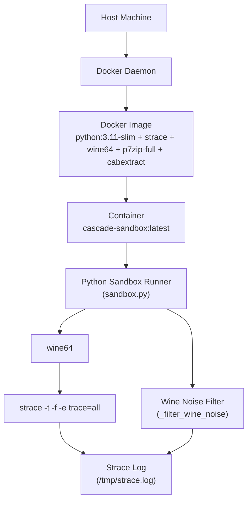
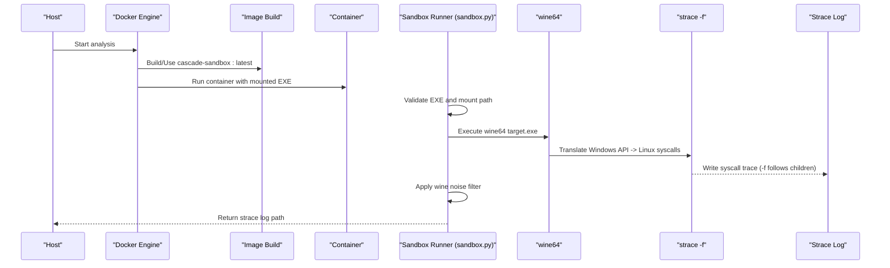
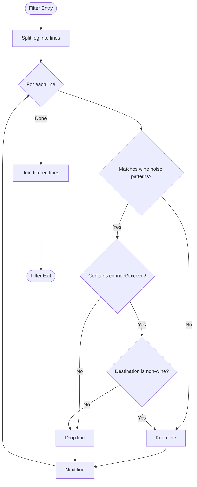
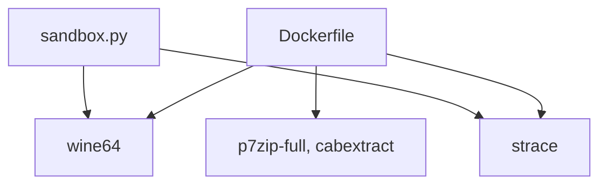

# Windows EXE Analysis

<cite>
**Referenced Files in This Document**
- [Dockerfile](file://sandbox/Dockerfile)
- [sandbox.py](file://sandbox/sandbox.py)
- [README.md](file://README.md)
- [mcp/sandbox.py](file://mcp/sandbox.py)
</cite>

## Table of Contents
1. [Introduction](#introduction)
2. [Project Structure](#project-structure)
3. [Core Components](#core-components)
4. [Architecture Overview](#architecture-overview)
5. [Detailed Component Analysis](#detailed-component-analysis)
6. [Dependency Analysis](#dependency-analysis)
7. [Performance Considerations](#performance-considerations)
8. [Troubleshooting Guide](#troubleshooting-guide)
9. [Conclusion](#conclusion)
10. [Appendices](#appendices)

## Introduction
This document explains how the project analyzes Windows EXE files using wine64 emulation and syscall translation. It covers the sandbox environment setup, EXE execution methodology with strace tracing (including process tree monitoring and child process handling), wine64 initialization filtering to reduce noise, timeout mechanisms to avoid hangs, and how syscall translation affects behavioral signature detection. It also provides troubleshooting guidance and examples of analyzing common Windows executables.

## Project Structure
The Windows EXE analysis capability is implemented in the sandbox module and Docker image definition:
- The Docker image defines the runtime environment with wine64 and strace.
- The sandbox runner orchestrates container lifecycle, mounts the target EXE, executes wine64 under strace, filters wine initialization noise, and retrieves the strace log.

**Diagram sources**
- [Dockerfile:1-11](file://sandbox/Dockerfile#L1-L11)
- [sandbox.py:118-177](file://sandbox/sandbox.py#L118-L177)
- [sandbox.py:338-376](file://sandbox/sandbox.py#L338-L376)

**Section sources**
- [Dockerfile:1-11](file://sandbox/Dockerfile#L1-L11)
- [sandbox.py:118-177](file://sandbox/sandbox.py#L118-L177)
- [sandbox.py:338-376](file://sandbox/sandbox.py#L338-L376)

## Core Components
- Wine64 installation and configuration
  - The Docker image installs wine64 and related tools, ensuring wine64 is available inside the sandbox.
- EXE execution under wine64 with strace
  - The runner validates the EXE, mounts it into the container, and executes wine64 under strace with full process tree tracing (-f).
- Process tree monitoring and child process handling
  - The -f flag ensures strace captures syscalls from child processes spawned by the EXE (common for installers).
- Wine initialization filtering
  - A post-processing filter removes noise from wine’s initialization (DLL loads, prefix creation) while preserving suspicious syscalls.
- Timeout mechanisms
  - A 30-second timeout prevents GUI installers or interactive EXEs from hanging the analysis.
- Syscall translation and behavioral signatures
  - Wine translates Windows API calls to Linux syscalls. This affects visibility of Windows-specific behavior and may alter signature detection.

**Section sources**
- [Dockerfile:3-7](file://sandbox/Dockerfile#L3-L7)
- [sandbox.py:118-177](file://sandbox/sandbox.py#L118-L177)
- [sandbox.py:338-376](file://sandbox/sandbox.py#L338-L376)
- [README.md:330-336](file://README.md#L330-L336)

## Architecture Overview
The Windows EXE analysis pipeline runs inside a Docker container with network isolation and strace instrumentation. The flow is:

**Diagram sources**
- [sandbox.py:175-336](file://sandbox/sandbox.py#L175-L336)
- [sandbox.py:118-177](file://sandbox/sandbox.py#L118-L177)
- [Dockerfile:1-11](file://sandbox/Dockerfile#L1-L11)

## Detailed Component Analysis

### Wine64 Installation and Configuration
- The Docker image installs wine64 and supporting tools (strace, p7zip-full, cabextract) in a python:3.11-slim base, ensuring the sandbox environment includes wine64.
- The sandbox runner checks for wine64 availability and reports a diagnostic message if not present.

**Section sources**
- [Dockerfile:3-7](file://sandbox/Dockerfile#L3-L7)
- [sandbox.py:124-129](file://sandbox/sandbox.py#L124-L129)

### EXE Execution Methodology with Strace
- The runner mounts the EXE into the container and executes wine64 under strace with:
  - -t: timestamps for temporal analysis
  - -f: follows child processes
  - -e trace=all: captures all syscalls
  - -s 1000: increases string length capture
- Wine stderr is redirected to a separate file to avoid polluting the strace log.

**Section sources**
- [sandbox.py:153-166](file://sandbox/sandbox.py#L153-L166)

### Process Tree Monitoring and Child Process Handling
- The -f flag ensures strace captures syscalls from child processes spawned by the EXE, which is essential for installers and EXEs that launch helper processes.

**Section sources**
- [sandbox.py:149-150](file://sandbox/sandbox.py#L149-L150)

### Wine Initialization Filtering
- The filter removes noise from wine initialization (e.g., loading wine DLLs, creating prefix directories, system DLL loading) while preserving suspicious syscalls such as connect or execve to non-wine destinations.
- The filter keeps lines that:
  - Do not match wine-specific noise patterns
  - Contain connect/execve to non-wine destinations

**Diagram sources**
- [sandbox.py:338-376](file://sandbox/sandbox.py#L338-L376)

**Section sources**
- [sandbox.py:338-376](file://sandbox/sandbox.py#L338-L376)

### Timeout Mechanisms
- The runner enforces a 30-second timeout around wine64 execution to prevent GUI installers or interactive EXEs from hanging the analysis.
- The container-level timeout is 180 seconds for EXE runs to account for potential setup overhead.

**Section sources**
- [sandbox.py:164-166](file://sandbox/sandbox.py#L164-L166)
- [sandbox.py:333-343](file://sandbox/sandbox.py#L333-L343)

### Syscall Translation and Behavioral Signature Detection
- Wine translates Windows API calls into Linux syscalls. This affects behavioral signature detection because:
  - Windows-specific APIs (registry, COM, Windows-specific paths) translate to Linux syscalls, potentially altering the observable syscall profile.
  - GUI applications that wait for user input will timeout after 30 seconds, limiting observed behavior.
- The strace log is later parsed and matched against behavioral signatures and temporal patterns.

**Section sources**
- [README.md:330-336](file://README.md#L330-L336)
- [sandbox.py:164-166](file://sandbox/sandbox.py#L164-L166)

### Example Analysis Workflows
- Executable installer (MSI/EXE)
  - Mount the EXE into the container and run wine64 under strace with -f to capture child processes.
  - Apply wine noise filter to reduce initialization noise.
  - Retrieve the strace log for downstream parsing and signature matching.
- Interactive installer
  - Expect a 30-second timeout; the runner kills the container if the timeout is exceeded.
- GUI application
  - Expect early termination or limited behavior due to the timeout; the runner still captures syscalls until the timeout.

**Section sources**
- [sandbox.py:118-177](file://sandbox/sandbox.py#L118-L177)
- [sandbox.py:333-343](file://sandbox/sandbox.py#L333-L343)

## Dependency Analysis
- Runtime dependencies for EXE analysis:
  - wine64 (installed in the Docker image)
  - strace (installed in the Docker image)
  - p7zip-full and cabextract (for archive handling)
- The sandbox runner depends on the Docker Python SDK to orchestrate containers and retrieve logs.

**Diagram sources**
- [Dockerfile:3-7](file://sandbox/Dockerfile#L3-L7)
- [sandbox.py:118-177](file://sandbox/sandbox.py#L118-L177)

**Section sources**
- [Dockerfile:3-7](file://sandbox/Dockerfile#L3-L7)
- [sandbox.py:118-177](file://sandbox/sandbox.py#L118-L177)

## Performance Considerations
- Wine translation overhead: Wine adds translation latency and may alter syscall visibility.
- Filtering cost: The wine noise filter processes the entire strace log; keep logs concise by avoiding excessive verbosity.
- Container timeouts: Tune the 30-second wine64 timeout and container-level timeout (180s) based on EXE characteristics.
- Network isolation: Dropping the network interface reduces overhead and prevents external interference.

[No sources needed since this section provides general guidance]

## Troubleshooting Guide
Common issues and resolutions:
- wine64 not installed in the sandbox
  - Symptom: Diagnostic message indicating wine64 is not available.
  - Resolution: Rebuild the sandbox image to ensure wine64 is installed.
  - Section sources
    - [sandbox.py:124-129](file://sandbox/sandbox.py#L124-L129)
    - [Dockerfile:3-7](file://sandbox/Dockerfile#L3-L7)
- EXE not found or empty
  - Symptom: File not found or empty file messages.
  - Resolution: Verify the EXE path and permissions; ensure the file exists and is readable.
  - Section sources
    - [sandbox.py:131-143](file://sandbox/sandbox.py#L131-L143)
- No strace output captured
  - Symptom: Warning that no strace output was captured; examine wine stderr for clues.
  - Resolution: Check wine stderr; the runner prints it for diagnostics.
  - Section sources
    - [sandbox.py:169-174](file://sandbox/sandbox.py#L169-L174)
- GUI application or installer hangs
  - Symptom: Analysis exceeds the 30-second timeout.
  - Resolution: Expected behavior for interactive installers; adjust expectations or isolate headless modes if available.
  - Section sources
    - [sandbox.py:164-166](file://sandbox/sandbox.py#L164-L166)
    - [sandbox.py:333-343](file://sandbox/sandbox.py#L333-L343)
- Wine initialization noise dominates logs
  - Symptom: Many syscalls related to wine DLLs and prefix creation.
  - Resolution: Use the wine noise filter to remove initialization noise while preserving suspicious syscalls.
  - Section sources
    - [sandbox.py:338-376](file://sandbox/sandbox.py#L338-L376)

## Conclusion
The Windows EXE analysis pipeline leverages wine64 and strace to observe translated syscalls from Windows binaries in a controlled, isolated environment. The sandbox enforces timeouts, traces child processes, and filters wine initialization noise to improve signal-to-noise. While Wine translation alters the visibility of Windows-specific behavior, the approach remains effective for detecting suspicious syscalls and behavioral patterns.

[No sources needed since this section summarizes without analyzing specific files]

## Appendices

### Appendix A: How Wine Translation Affects Behavior Detection
- Windows API calls are translated to Linux syscalls; this can:
  - Reduce visibility of registry and COM operations
  - Change path semantics and file descriptor behavior
  - Introduce differences in timing and process spawning
- Behavioral signatures rely on syscall patterns; expect adjusted profiles compared to native Windows environments.

**Section sources**
- [README.md:330-336](file://README.md#L330-L336)

### Appendix B: Related Sandbox Patterns
- The MCP sandbox demonstrates similar strace instrumentation and container orchestration patterns, useful for understanding broader sandbox behavior.

**Section sources**
- [mcp/sandbox.py:148-232](file://mcp/sandbox.py#L148-L232)