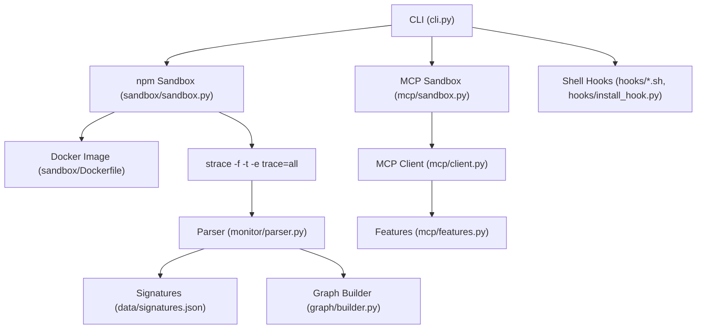
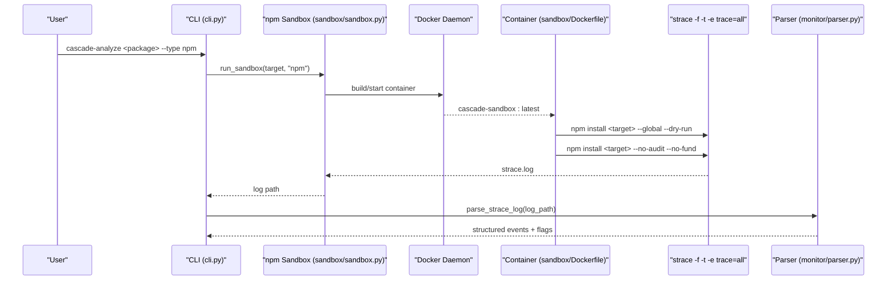
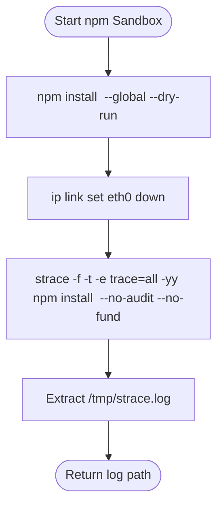
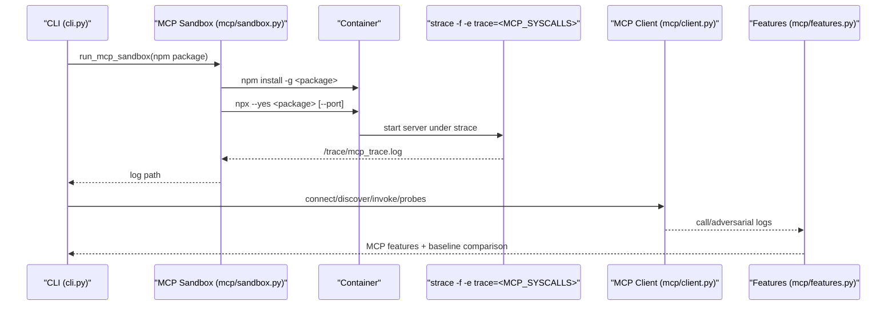
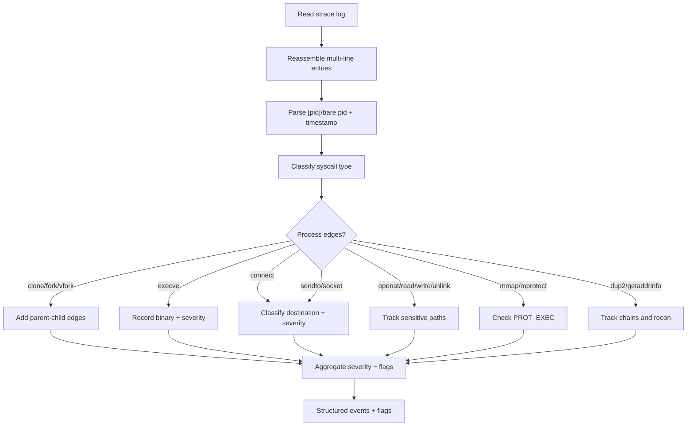
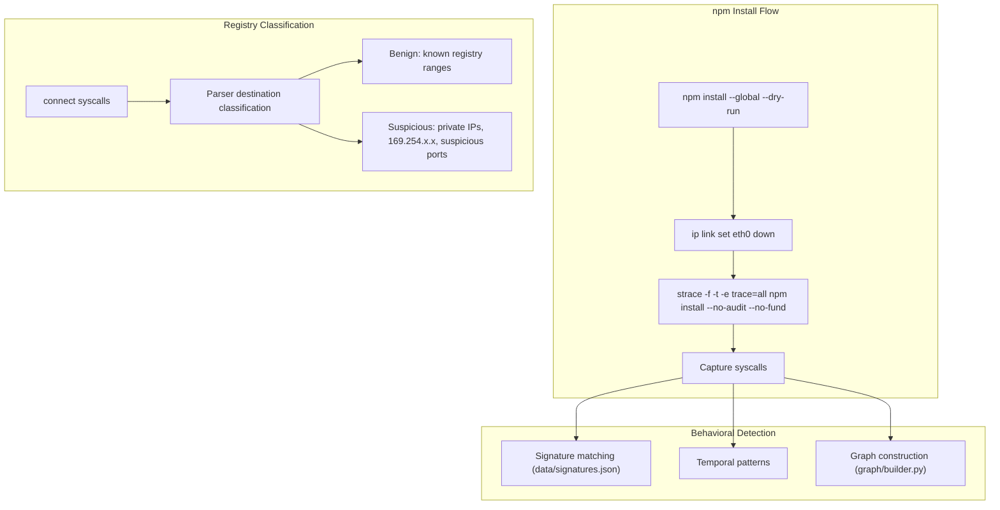

# npm Package Analysis

<cite>
**Referenced Files in This Document**
- [README.md](file://README.md)
- [cli.py](file://cli.py)
- [sandbox/sandbox.py](file://TraceTree/sandbox/sandbox.py)
- [sandbox/Dockerfile](file://sandbox/Dockerfile)
- [mcp/sandbox.py](file://mcp/sandbox.py)
- [monitor/parser.py](file://monitor/parser.py)
- [graph/builder.py](file://graph/builder.py)
- [mcp/client.py](file://mcp/client.py)
- [mcp/features.py](file://mcp/features.py)
- [hooks/install_hook.py](file://hooks/install_hook.py)
- [hooks/install_hook.sh](file://hooks/install_hook.sh)
- [hooks/shell_hook.sh](file://hooks/shell_hook.sh)
- [data/signatures.json](file://data/signatures.json)
</cite>

## Table of Contents
1. [Introduction](#introduction)
2. [Project Structure](#project-structure)
3. [Core Components](#core-components)
4. [Architecture Overview](#architecture-overview)
5. [Detailed Component Analysis](#detailed-component-analysis)
6. [Dependency Analysis](#dependency-analysis)
7. [Performance Considerations](#performance-considerations)
8. [Troubleshooting Guide](#troubleshooting-guide)
9. [Conclusion](#conclusion)
10. [Appendices](#appendices)

## Introduction
This document explains how TraceTree analyzes npm packages using sandboxed containers, strace-based syscall tracing, and behavioral detection. It covers Node.js runtime environment setup, npm install dry-run and global modes, package.json parsing, registry interactions, dependency resolution, transitive dependency analysis, and MCP server security analysis. It also provides troubleshooting guidance for npm authentication and connectivity issues, and demonstrates typical syscall patterns for popular npm packages.

## Project Structure
The npm analysis capability spans several modules:
- CLI orchestrator for npm targets
- Sandbox runner for npm install and strace capture
- MCP sandbox for npm-based servers
- Parser for strace logs and behavioral signatures
- Graph builder for execution graphs
- Hooks for shell integration

**Diagram sources**
- [cli.py:305-482](file://cli.py#L305-L482)
- [sandbox/sandbox.py:175-335](file://TraceTree/sandbox/sandbox.py#L175-L335)
- [sandbox/Dockerfile:1-11](file://sandbox/Dockerfile#L1-11)
- [monitor/parser.py:342-682](file://monitor/parser.py#L342-L682)
- [data/signatures.json:1-246](file://data/signatures.json#L1-L246)
- [graph/builder.py:8-196](file://graph/builder.py#L8-L196)
- [mcp/sandbox.py:41-146](file://mcp/sandbox.py#L41-L146)
- [mcp/client.py:18-473](file://mcp/client.py#L18-L473)
- [mcp/features.py:32-473](file://mcp/features.py#L32-L473)
- [hooks/install_hook.py:71-129](file://hooks/install_hook.py#L71-L129)
- [hooks/install_hook.sh:1-60](file://hooks/install_hook.sh#L1-L60)
- [hooks/shell_hook.sh:1-93](file://hooks/shell_hook.sh#L1-L93)

**Section sources**
- [README.md:95-103](file://README.md#L95-L103)
- [cli.py:305-482](file://cli.py#L305-L482)

## Core Components
- npm Sandbox runner: Executes npm install in a containerized environment, supports dry-run and global installation, disables network during tracing, and captures strace logs.
- MCP Sandbox: Runs npm-based MCP servers in a sandbox, traces syscalls, simulates client interactions, and extracts MCP-specific features.
- Parser: Parses strace logs, classifies network destinations, flags sensitive file access, and builds event streams with severity weights.
- Graph Builder: Converts parsed events into a NetworkX graph with process, file, and network nodes and temporal edges.
- Signature Engine: Matches behavioral patterns against parsed events.
- Shell Hooks: Automates repository watching after git clone.

**Section sources**
- [sandbox/sandbox.py:175-335](file://TraceTree/sandbox/sandbox.py#L175-L335)
- [mcp/sandbox.py:41-146](file://mcp/sandbox.py#L41-L146)
- [monitor/parser.py:342-682](file://monitor/parser.py#L342-L682)
- [graph/builder.py:8-196](file://graph/builder.py#L8-L196)
- [data/signatures.json:1-246](file://data/signatures.json#L1-L246)
- [hooks/install_hook.py:71-129](file://hooks/install_hook.py#L71-L129)

## Architecture Overview
The npm analysis pipeline executes inside a Docker container with strace tracing enabled. For npm packages, the sandbox:
- Runs npm install with a dry-run to determine planned actions
- Blocks network connectivity (ip link set eth0 down)
- Traces npm install with strace -f -t -e trace=all
- Captures and returns the strace log for post-processing

**Diagram sources**
- [cli.py:305-482](file://cli.py#L305-L482)
- [sandbox/sandbox.py:223-228](file://TraceTree/sandbox/sandbox.py#L223-L228)
- [sandbox/sandbox.py:248-335](file://TraceTree/sandbox/sandbox.py#L248-L335)
- [sandbox/Dockerfile:1-11](file://sandbox/Dockerfile#L1-L11)
- [monitor/parser.py:342-682](file://monitor/parser.py#L342-L682)

**Section sources**
- [README.md:35-42](file://README.md#L35-L42)
- [sandbox/sandbox.py:175-335](file://TraceTree/sandbox/sandbox.py#L175-L335)

## Detailed Component Analysis

### npm Sandbox Runner
- Purpose: Execute npm install in a controlled environment, capture syscalls, and return a strace log.
- Key behaviors:
  - Dry-run mode: npm install <target> --global --dry-run
  - Global install mode: npm install <target> --no-audit --no-fund
  - Network blocking: ip link set eth0 down
  - strace tracing: -f (follow children), -t (timestamps), -e trace=all, -yy (resolve AF_UNIX sockets)
  - Timeout handling and container lifecycle management
  - Log extraction and filtering for EXE/Wine noise (not applicable to npm)

**Diagram sources**
- [sandbox/sandbox.py:223-228](file://TraceTree/sandbox/sandbox.py#L223-L228)
- [sandbox/sandbox.py:248-335](file://TraceTree/sandbox/sandbox.py#L248-L335)

**Section sources**
- [sandbox/sandbox.py:175-335](file://TraceTree/sandbox/sandbox.py#L175-L335)
- [sandbox/Dockerfile:1-11](file://sandbox/Dockerfile#L1-L11)

### MCP Sandbox for npm Servers
- Purpose: Run npm-based MCP servers in a sandbox, trace syscalls, simulate client interactions, and extract MCP-specific features.
- Key behaviors:
  - Global install and npx execution for npm servers
  - strace -f with a focused syscall set for MCP analysis
  - HTTP or stdio transport support
  - Network blocking or allowance configurable
  - Server info extraction and log retrieval

**Diagram sources**
- [mcp/sandbox.py:41-146](file://mcp/sandbox.py#L41-L146)
- [mcp/sandbox.py:235-271](file://mcp/sandbox.py#L235-L271)
- [mcp/client.py:78-184](file://mcp/client.py#L78-L184)
- [mcp/features.py:32-206](file://mcp/features.py#L32-L206)

**Section sources**
- [mcp/sandbox.py:41-146](file://mcp/sandbox.py#L41-L146)
- [mcp/client.py:18-473](file://mcp/client.py#L18-L473)
- [mcp/features.py:32-473](file://mcp/features.py#L32-L473)

### strace Parser and Behavioral Detection
- Purpose: Parse strace logs, classify network destinations, flag sensitive file access, and compute severity scores.
- Key behaviors:
  - Multi-line entry reassembly and timestamp parsing
  - Syscall categorization (process, network, file, memory, IPC)
  - Network destination classification (safe registry, known benign, suspicious, unknown)
  - Sensitive path detection and benign path filtering
  - Severity weighting and signature matching

**Diagram sources**
- [monitor/parser.py:182-221](file://monitor/parser.py#L182-L221)
- [monitor/parser.py:227-244](file://monitor/parser.py#L227-L244)
- [monitor/parser.py:342-682](file://monitor/parser.py#L342-L682)

**Section sources**
- [monitor/parser.py:342-682](file://monitor/parser.py#L342-L682)
- [data/signatures.json:1-246](file://data/signatures.json#L1-L246)

### Graph Construction
- Purpose: Build a NetworkX directed graph representing process lineage, syscall targets, and temporal relationships.
- Key behaviors:
  - Nodes: process, network, file
  - Edges: syscall labels with severity weights
  - Temporal edges: consecutive same-PID events within a 5-second window
  - Signature tagging and graph statistics

**Section sources**
- [graph/builder.py:8-196](file://graph/builder.py#L8-L196)

### Shell Hooks and Automation
- Purpose: Automatically start repository watching after git clone.
- Key behaviors:
  - Detect shell (bash/zsh) and append source line to RC file
  - Wrap git clone to trigger cascade-watch in background

**Section sources**
- [hooks/install_hook.py:71-129](file://hooks/install_hook.py#L71-L129)
- [hooks/install_hook.sh:1-60](file://hooks/install_hook.sh#L1-60)
- [hooks/shell_hook.sh:1-93](file://hooks/shell_hook.sh#L1-L93)

## Dependency Analysis
- npm install process:
  - The sandbox runs npm install with global and dry-run modes, then traces the actual install under strace.
  - Network is blocked during tracing to capture outbound attempts while preventing real downloads.
- Registry interactions:
  - The parser classifies connect syscalls; known package registry ranges are treated as benign.
  - Suspicious destinations (cloud metadata, private IPs, suspicious ports) increase risk.
- Transitive dependency analysis:
  - The strace log captures all process spawns and file accesses; signature and temporal analyzers can flag suspicious chains (e.g., credential theft, reverse shells).
- MCP server behavior:
  - The MCP sandbox runs npm servers under strace and simulates client tool discovery and invocation, enabling detection of command injection, covert network calls, and path traversal.

**Diagram sources**
- [sandbox/sandbox.py:223-228](file://TraceTree/sandbox/sandbox.py#L223-L228)
- [monitor/parser.py:246-318](file://monitor/parser.py#L246-L318)
- [data/signatures.json:1-246](file://data/signatures.json#L1-L246)
- [graph/builder.py:8-196](file://graph/builder.py#L8-L196)

**Section sources**
- [sandbox/sandbox.py:175-335](file://TraceTree/sandbox/sandbox.py#L175-L335)
- [monitor/parser.py:246-318](file://monitor/parser.py#L246-L318)
- [data/signatures.json:1-246](file://data/signatures.json#L1-L246)
- [graph/builder.py:8-196](file://graph/builder.py#L8-L196)

## Performance Considerations
- strace overhead: Tracing all syscalls (-e trace=all) increases overhead; the MCP sandbox narrows the syscall set for efficiency.
- Container timeouts: npm installs are bounded by timeouts; adjust as needed for large packages.
- Log size: Large strace logs can impact I/O; ensure sufficient disk space in the container.
- Network blocking: Disabling the network interface prevents real downloads but allows detection of intended outbound connections.

[No sources needed since this section provides general guidance]

## Troubleshooting Guide
- Docker not running or unreachable:
  - The CLI checks Docker availability and prints OS-specific installation and startup instructions.
- npm authentication issues:
  - The sandbox does not configure npm credentials; ensure credentials are available in the container environment if required.
- Registry connectivity problems:
  - Network is blocked during tracing; any outbound attempts are logged. Review parser classifications for suspicious destinations.
- Dependency conflicts:
  - Use dry-run mode to preview actions; inspect strace logs for unexpected process spawns or file writes.
- MCP server transport issues:
  - For HTTP transport, verify the port and that the endpoint responds; for stdio transport, ensure the server supports stdin/stdout.

**Section sources**
- [cli.py:74-111](file://cli.py#L74-L111)
- [cli.py:563-743](file://cli.py#L563-L743)
- [mcp/sandbox.py:107-146](file://mcp/sandbox.py#L107-L146)
- [monitor/parser.py:246-318](file://monitor/parser.py#L246-L318)

## Conclusion
TraceTree’s npm analysis leverages a sandboxed container environment with strace-based syscall tracing to detect suspicious npm package behavior. The pipeline supports dry-run and global install modes, network blocking, registry classification, signature matching, temporal analysis, and graph construction. For MCP servers, it simulates client interactions and extracts MCP-specific features to identify threats such as command injection and covert network calls.

[No sources needed since this section summarizes without analyzing specific files]

## Appendices

### Example: Analyzing Popular npm Packages
- Typical syscall patterns:
  - Process creation: clone/fork/execve for native add-ons or post-install scripts
  - Network: connect to npm registry ranges (benign), or suspicious domains/ports (flagged)
  - Filesystem: openat/read/write for installing binaries and configuration
- Behavioral detection signatures:
  - Reverse shell: connect → dup2 → execve /bin/sh
  - Credential theft: openat sensitive files → connect to external host
  - Crypto miner: repeated clone/connect to mining pools
  - DNS tunneling: getaddrinfo + sendto on DNS ports

**Section sources**
- [data/signatures.json:1-246](file://data/signatures.json#L1-L246)
- [monitor/parser.py:479-522](file://monitor/parser.py#L479-L522)
- [monitor/parser.py:584-598](file://monitor/parser.py#L584-L598)

### Node.js Runtime Environment Setup
- The sandbox image includes Node.js and npm, enabling npm install and npx execution.
- For MCP servers, the sandbox installs the package globally and runs via npx.

**Section sources**
- [sandbox/Dockerfile:3-7](file://sandbox/Dockerfile#L3-L7)
- [mcp/sandbox.py:235-252](file://mcp/sandbox.py#L235-L252)

### package.json Parsing and Module Execution Tracing
- The CLI supports bulk analysis from package.json and interprets target types accordingly.
- Module execution tracing relies on strace capturing all process spawns and network/file accesses.

**Section sources**
- [cli.py:112-124](file://cli.py#L112-L124)
- [cli.py:324-340](file://cli.py#L324-L340)
- [monitor/parser.py:342-682](file://monitor/parser.py#L342-L682)