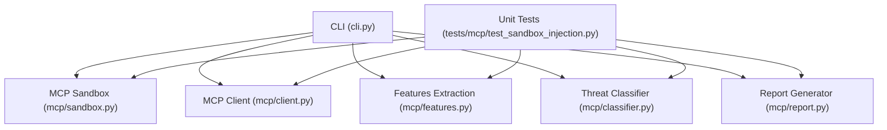
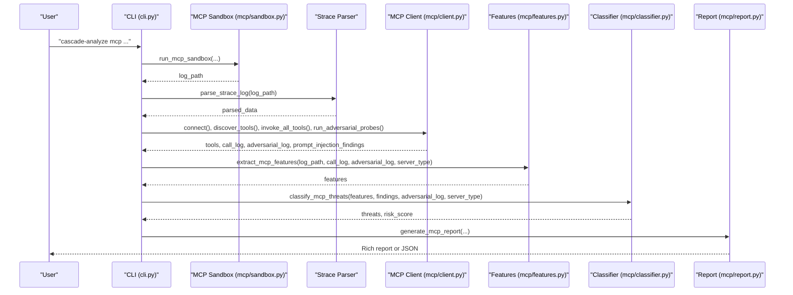
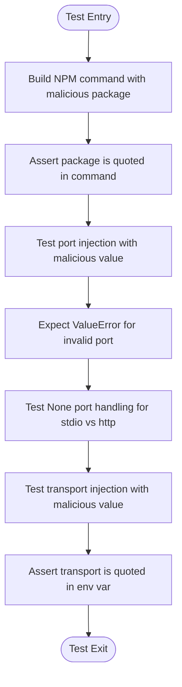
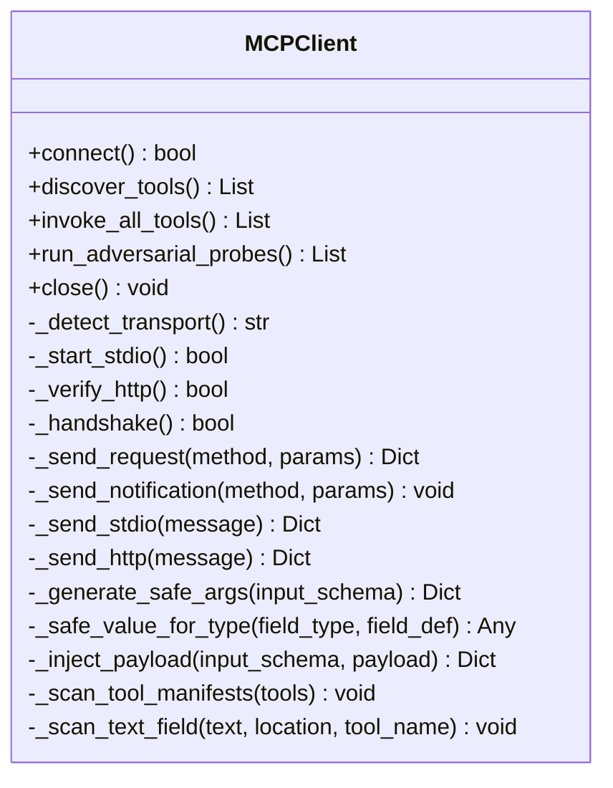
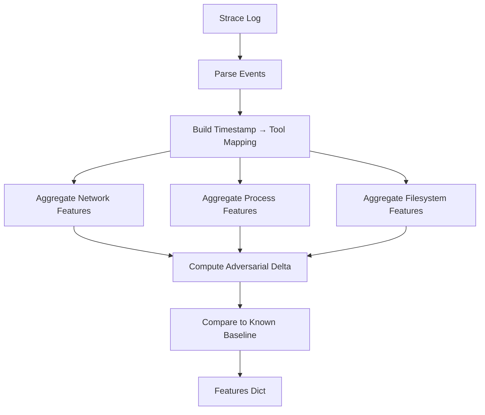
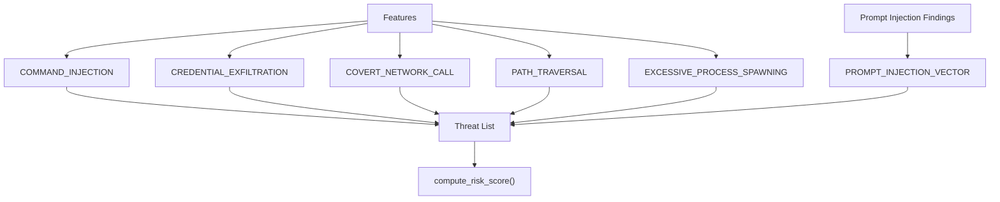
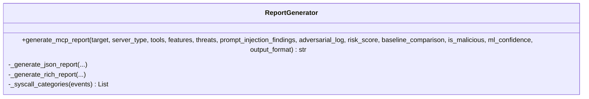
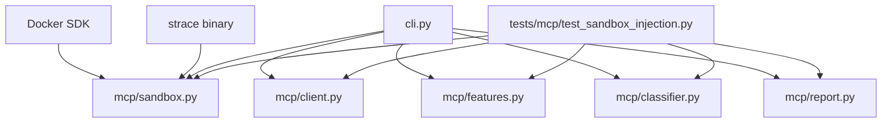

# Testing and Validation

<cite>
**Referenced Files in This Document**
- [README.md](file://README.md)
- [pyproject.toml](file://pyproject.toml)
- [cli.py](file://cli.py)
- [tests/mcp/test_sandbox_injection.py](file://tests/mcp/test_sandbox_injection.py)
- [mcp/sandbox.py](file://mcp/sandbox.py)
- [mcp/client.py](file://mcp/client.py)
- [mcp/features.py](file://mcp/features.py)
- [mcp/classifier.py](file://mcp/classifier.py)
- [mcp/report.py](file://mcp/report.py)
</cite>

## Table of Contents
1. [Introduction](#introduction)
2. [Project Structure](#project-structure)
3. [Core Components](#core-components)
4. [Architecture Overview](#architecture-overview)
5. [Detailed Component Analysis](#detailed-component-analysis)
6. [Dependency Analysis](#dependency-analysis)
7. [Performance Considerations](#performance-considerations)
8. [Troubleshooting Guide](#troubleshooting-guide)
9. [Conclusion](#conclusion)
10. [Appendices](#appendices)

## Introduction
This document describes TraceTree’s testing framework and validation procedures with a focus on unit testing, integration testing, and security validation for MCP (Model Context Protocol) servers. It explains the test suite organization, MCP security testing approach (injection vulnerability testing, adversarial input validation, and response analysis), testing data management, and guidance for writing custom tests, validating analysis results, and performance benchmarking. It also covers continuous integration patterns and quality assurance procedures to maintain analysis accuracy and reliability.

## Project Structure
TraceTree integrates MCP security analysis into the main CLI pipeline. The MCP workflow is orchestrated by the CLI and validated through targeted unit tests. The MCP module consists of:
- Sandbox orchestration and Docker containerization
- Simulated MCP client for discovery, invocation, and adversarial probing
- Feature extraction from syscall traces
- Rule-based threat classification
- Report generation

**Diagram sources**
- [cli.py:564-744](file://cli.py#L564-L744)
- [mcp/sandbox.py:41-146](file://mcp/sandbox.py#L41-L146)
- [mcp/client.py:18-473](file://mcp/client.py#L18-L473)
- [mcp/features.py:32-206](file://mcp/features.py#L32-L206)
- [mcp/classifier.py:61-96](file://mcp/classifier.py#L61-L96)
- [mcp/report.py:27-74](file://mcp/report.py#L27-L74)
- [tests/mcp/test_sandbox_injection.py:1-57](file://tests/mcp/test_sandbox_injection.py#L1-L57)

**Section sources**
- [README.md:265-305](file://README.md#L265-L305)
- [cli.py:564-744](file://cli.py#L564-L744)

## Core Components
- MCP Sandbox: Builds and runs the MCP server in a Docker container with strace instrumentation, enforcing network isolation and extracting logs.
- MCP Client: Simulates an MCP client to perform JSON-RPC 2.0 handshake, discover tools, invoke them with safe synthetic arguments, and run adversarial probes.
- Features Extraction: Parses strace logs and extracts MCP-specific features grouped by tool-call activity (network, process, filesystem, injection response).
- Threat Classifier: Applies rule-based checks to derive threat categories and compute a risk score.
- Report Generator: Produces Rich console reports and JSON outputs for machine-readable consumption.

**Section sources**
- [mcp/sandbox.py:41-146](file://mcp/sandbox.py#L41-L146)
- [mcp/client.py:18-473](file://mcp/client.py#L18-L473)
- [mcp/features.py:32-206](file://mcp/features.py#L32-L206)
- [mcp/classifier.py:61-96](file://mcp/classifier.py#L61-L96)
- [mcp/report.py:27-74](file://mcp/report.py#L27-L74)

## Architecture Overview
The MCP security analysis pipeline integrates with the main CLI. It orchestrates sandboxing, client simulation, feature extraction, classification, and reporting.

**Diagram sources**
- [cli.py:564-744](file://cli.py#L564-L744)
- [mcp/sandbox.py:41-146](file://mcp/sandbox.py#L41-L146)
- [mcp/client.py:78-195](file://mcp/client.py#L78-L195)
- [mcp/features.py:32-206](file://mcp/features.py#L32-L206)
- [mcp/classifier.py:61-96](file://mcp/classifier.py#L61-L96)
- [mcp/report.py:27-74](file://mcp/report.py#L27-L74)

## Detailed Component Analysis

### Unit Tests: MCP Sandbox Injection
The unit test suite validates MCP sandbox command construction and injection protections. It ensures:
- Package name injection is safely quoted in generated commands
- Port injection is rejected with ValueError
- Transport injection is safely quoted in environment variables
- None port handling behaves consistently across transports

**Diagram sources**
- [tests/mcp/test_sandbox_injection.py:4-50](file://tests/mcp/test_sandbox_injection.py#L4-L50)

**Section sources**
- [tests/mcp/test_sandbox_injection.py:1-57](file://tests/mcp/test_sandbox_injection.py#L1-L57)
- [mcp/sandbox.py:235-271](file://mcp/sandbox.py#L235-L271)

### MCP Client: Adversarial Probing and Safe Argument Generation
The MCP client simulates a JSON-RPC 2.0 client to:
- Auto-detect transport (stdio vs http)
- Perform handshake and tool discovery
- Invoke tools with safe synthetic arguments derived from JSON schemas
- Run adversarial probes with predefined payloads
- Scan tool manifests for prompt injection indicators

**Diagram sources**
- [mcp/client.py:18-473](file://mcp/client.py#L18-L473)

**Section sources**
- [mcp/client.py:78-195](file://mcp/client.py#L78-L195)
- [mcp/client.py:364-418](file://mcp/client.py#L364-L418)
- [mcp/client.py:423-473](file://mcp/client.py#L423-L473)

### MCP Features Extraction: Syscall Trace Analysis
The features extractor parses strace logs and builds MCP-specific features:
- Network behavior: unexpected outbound connections, DNS lookups, per-tool connection counts
- Process behavior: child process spawning, shell invocations, execve targets
- Filesystem behavior: sensitive path reads, outside-working-directory reads
- Injection response: behavior change under adversarial input, shell spawn during injection
- Baseline comparison: deviation from known server type baselines

**Diagram sources**
- [mcp/features.py:109-206](file://mcp/features.py#L109-L206)
- [mcp/features.py:324-473](file://mcp/features.py#L324-L473)

**Section sources**
- [mcp/features.py:32-206](file://mcp/features.py#L32-L206)
- [mcp/features.py:387-422](file://mcp/features.py#L387-L422)

### Threat Classification: Rule-Based MCP Detection
The classifier applies rule-based checks to derive threat categories and compute a risk score:
- COMMAND_INJECTION: shell spawn during injection, behavior change under adversarial input, crashes from probes
- CREDENTIAL_EXFILTRATION: sensitive file access followed by network connections
- COVERT_NETWORK_CALL: unexpected outbound connections and DNS during tool calls
- PATH_TRAVERSAL: reads outside working directory and sensitive path accesses
- EXCESSIVE_PROCESS_SPAWNING: disproportionate child processes relative to tool calls
- PROMPT_INJECTION_VECTOR: zero-width characters and prompt injection language in tool descriptions

**Diagram sources**
- [mcp/classifier.py:61-96](file://mcp/classifier.py#L61-L96)
- [mcp/classifier.py:99-127](file://mcp/classifier.py#L99-L127)
- [mcp/classifier.py:239-268](file://mcp/classifier.py#L239-L268)

**Section sources**
- [mcp/classifier.py:21-58](file://mcp/classifier.py#L21-L58)
- [mcp/classifier.py:99-127](file://mcp/classifier.py#L99-L127)
- [mcp/classifier.py:239-268](file://mcp/classifier.py#L239-L268)

### Report Generation: Structured Output
The report generator produces:
- Tool manifest with descriptions and parameters
- Prompt injection scan results
- Per-tool syscall summaries
- Threat detections with evidence
- Adversarial probe results
- Overall risk score and baseline comparison
- JSON output for automation and CI integration

**Diagram sources**
- [mcp/report.py:27-74](file://mcp/report.py#L27-L74)
- [mcp/report.py:76-134](file://mcp/report.py#L76-L134)
- [mcp/report.py:136-302](file://mcp/report.py#L136-L302)

**Section sources**
- [mcp/report.py:27-74](file://mcp/report.py#L27-L74)
- [mcp/report.py:76-134](file://mcp/report.py#L76-L134)
- [mcp/report.py:136-302](file://mcp/report.py#L136-L302)

## Dependency Analysis
The MCP pipeline depends on Docker for sandboxing and strace for syscall tracing. The CLI orchestrates the entire workflow and exposes the MCP subcommand. Unit tests target the MCP components directly to validate security-critical behaviors.

**Diagram sources**
- [mcp/sandbox.py:24-28](file://mcp/sandbox.py#L24-L28)
- [cli.py:564-744](file://cli.py#L564-L744)
- [tests/mcp/test_sandbox_injection.py:1-57](file://tests/mcp/test_sandbox_injection.py#L1-L57)

**Section sources**
- [mcp/sandbox.py:24-28](file://mcp/sandbox.py#L24-L28)
- [pyproject.toml:14-24](file://pyproject.toml#L14-L24)

## Performance Considerations
- Timeout control: The MCP sandbox enforces a configurable timeout to prevent runaway containers.
- Container resource constraints: The sandbox drops network and runs with non-root privileges to reduce overhead and risk.
- strace filtering: The MCP pipeline focuses on a curated set of syscalls to balance completeness and performance.
- JSON-RPC I/O: The MCP client uses buffered I/O and timeouts to avoid blocking on network or stdio transport.

[No sources needed since this section provides general guidance]

## Troubleshooting Guide
Common issues and resolutions:
- Docker not installed or unreachable: The CLI performs a preflight check and instructs users to install/start Docker.
- Sandbox fails to produce logs: The MCP workflow aborts early if no strace log is found.
- MCP client cannot connect: In stdio mode, connection failures are expected; analysis proceeds using strace features only.
- Port injection validation: Invalid ports raise ValueError to prevent command injection.
- Transport injection protection: Transport values are safely quoted in environment variables.

**Section sources**
- [cli.py:74-111](file://cli.py#L74-L111)
- [cli.py:631-636](file://cli.py#L631-L636)
- [cli.py:689-691](file://cli.py#L689-L691)
- [tests/mcp/test_sandbox_injection.py:14-27](file://tests/mcp/test_sandbox_injection.py#L14-L27)
- [tests/mcp/test_sandbox_injection.py:42-49](file://tests/mcp/test_sandbox_injection.py#L42-L49)

## Conclusion
TraceTree’s MCP testing framework combines unit tests for security-critical command construction, integration tests through the CLI pipeline, and robust security validation via adversarial probing and rule-based classification. The modular design enables targeted testing and reliable validation of MCP server behavior, supporting continuous integration and quality assurance workflows.

[No sources needed since this section summarizes without analyzing specific files]

## Appendices

### Writing Custom Tests
Guidance for extending the MCP test suite:
- Use the existing unit test pattern to validate command construction and injection protections.
- Add tests for new MCP client behaviors (e.g., additional JSON-RPC methods, transport modes).
- Extend feature extraction tests to cover new syscall categories or server types.
- Add adversarial probe coverage for additional payload types or prompt injection patterns.
- Include JSON report validation for machine-readable output consistency.

**Section sources**
- [tests/mcp/test_sandbox_injection.py:1-57](file://tests/mcp/test_sandbox_injection.py#L1-L57)
- [mcp/client.py:32-49](file://mcp/client.py#L32-L49)
- [mcp/features.py:387-422](file://mcp/features.py#L387-L422)

### Validating Analysis Results
Validation steps:
- Confirm strace logs are produced and parsable.
- Verify MCP client successfully connects and discovers tools.
- Ensure adversarial probes are sent and recorded.
- Review threat classifications and risk scores for plausibility.
- Validate report output (console and JSON) includes expected sections.

**Section sources**
- [cli.py:646-652](file://cli.py#L646-L652)
- [cli.py:674-691](file://cli.py#L674-L691)
- [mcp/report.py:27-74](file://mcp/report.py#L27-L74)

### Performance Benchmarking
Benchmarking recommendations:
- Measure end-to-end MCP analysis duration across different server types and transports.
- Track container startup time, sandbox runtime, and report generation latency.
- Monitor strace parsing throughput and feature extraction time.
- Compare risk scoring and classification latency for large tool manifests.

[No sources needed since this section provides general guidance]

### Continuous Integration Patterns
Recommended CI practices:
- Run unit tests for MCP components on every pull request.
- Execute the MCP CLI subcommand in a Docker-enabled environment to validate sandboxing and reporting.
- Store and compare JSON reports for regression detection.
- Integrate SARIF export for security tooling compatibility.

**Section sources**
- [README.md:265-305](file://README.md#L265-L305)
- [cli.py:564-744](file://cli.py#L564-L744)
- [mcp/report.py:61-73](file://mcp/report.py#L61-L73)