# Troubleshooting and FAQ

<cite>
**Referenced Files in This Document**
- [README.md](file://README.md)
- [cli.py](file://cli.py)
- [sandbox/sandbox.py](file://sandbox/sandbox.py)
- [mcp/sandbox.py](file://mcp/sandbox.py)
- [monitor/parser.py](file://monitor/parser.py)
- [monitor/signatures.py](file://monitor/signatures.py)
- [graph/builder.py](file://graph/builder.py)
- [ml/detector.py](file://ml/detector.py)
- [watcher/session.py](file://watcher/session.py)
- [hooks/install_hook.py](file://hooks/install_hook.py)
- [tests/mcp/test_sandbox_injection.py](file://tests/mcp/test_sandbox_injection.py)
- [pyproject.toml](file://pyproject.toml)
- [sandbox/Dockerfile](file://sandbox/Dockerfile)
- [data/signatures.json](file://data/signatures.json)
</cite>

## Table of Contents
1. [Introduction](#introduction)
2. [Project Structure](#project-structure)
3. [Core Components](#core-components)
4. [Architecture Overview](#architecture-overview)
5. [Detailed Component Analysis](#detailed-component-analysis)
6. [Dependency Analysis](#dependency-analysis)
7. [Performance Considerations](#performance-considerations)
8. [Troubleshooting Guide](#troubleshooting-guide)
9. [FAQ](#faq)
10. [Conclusion](#conclusion)

## Introduction
This document provides a comprehensive troubleshooting and FAQ guide for TraceTree. It focuses on diagnosing and resolving common issues such as Docker connectivity problems, permission errors, sandbox execution failures, and analysis timeouts. It also covers systematic debugging approaches, performance optimization, error interpretation (including strace parsing errors, signature matching failures, and machine learning model issues), and frequently asked questions about supported target types, behavioral detection accuracy, and integration challenges. Finally, it outlines escalation procedures and support resources for complex troubleshooting scenarios.

## Project Structure
TraceTree orchestrates a runtime behavioral analysis pipeline:
- CLI entrypoint validates Docker prerequisites and coordinates the pipeline.
- Sandbox containers execute targets under strace with network isolation.
- Parser converts strace logs into structured events.
- Signature matcher and temporal analyzer detect behavioral patterns.
- Graph builder constructs a NetworkX graph enriched with severity and signature tags.
- ML detector combines model predictions with severity boosting.
- MCP module extends analysis to Model Context Protocol servers.
- Watcher module supports continuous monitoring of repositories.

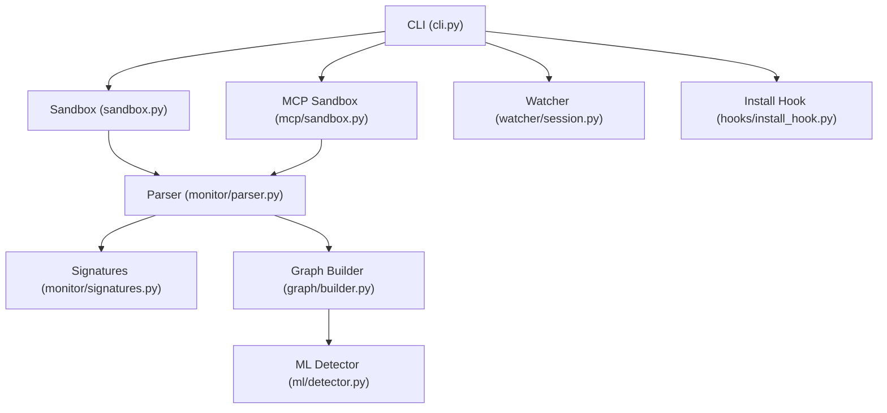

**Diagram sources**
- [cli.py](file://cli.py)
- [sandbox/sandbox.py](file://sandbox/sandbox.py)
- [mcp/sandbox.py](file://mcp/sandbox.py)
- [monitor/parser.py](file://monitor/parser.py)
- [monitor/signatures.py](file://monitor/signatures.py)
- [graph/builder.py](file://graph/builder.py)
- [ml/detector.py](file://ml/detector.py)
- [watcher/session.py](file://watcher/session.py)
- [hooks/install_hook.py](file://hooks/install_hook.py)

**Section sources**
- [README.md](file://README.md)
- [cli.py](file://cli.py)

## Core Components
- Docker connectivity checks and preflight validation occur early in the CLI to prevent cascading failures.
- Sandbox execution varies by target type with tailored timeouts and resource monitoring.
- Parser handles multi-line strace assembly, timestamps, and severity scoring.
- Signature matching uses a JSON-defined catalog with ordered and unordered patterns.
- Graph builder creates a NetworkX graph with temporal edges and severity tagging.
- ML detector supports both supervised and unsupervised fallbacks with severity boosting.
- MCP sandboxing adds transport-specific orchestration and strace instrumentation.
- Watcher provides background analysis and result streaming.

**Section sources**
- [cli.py](file://cli.py)
- [sandbox/sandbox.py](file://sandbox/sandbox.py)
- [mcp/sandbox.py](file://mcp/sandbox.py)
- [monitor/parser.py](file://monitor/parser.py)
- [monitor/signatures.py](file://monitor/signatures.py)
- [graph/builder.py](file://graph/builder.py)
- [ml/detector.py](file://ml/detector.py)
- [watcher/session.py](file://watcher/session.py)

## Architecture Overview
The pipeline integrates Docker orchestration, strace instrumentation, event parsing, pattern matching, temporal analysis, graph construction, and ML classification.

```mermaid
sequenceDiagram
participant User as "User"
participant CLI as "CLI (cli.py)"
participant SAN as "Sandbox (sandbox.py)"
participant PAR as "Parser (monitor/parser.py)"
participant SIG as "Signatures (monitor/signatures.py)"
participant GR as "Graph (graph/builder.py)"
participant ML as "Detector (ml/detector.py)"
User->>CLI : cascade-analyze <target>
CLI->>CLI : check_docker_preflight()
CLI->>SAN : run_sandbox(target, type)
SAN-->>CLI : strace log path or empty
CLI->>PAR : parse_strace_log(log_path)
PAR-->>CLI : parsed events
CLI->>SIG : load_signatures() + match_signatures(parsed)
SIG-->>CLI : matched signatures
CLI->>GR : build_cascade_graph(parsed, signatures)
GR-->>CLI : graph + stats
CLI->>ML : detect_anomaly(graph, parsed)
ML-->>CLI : verdict + confidence
CLI-->>User : report
```

**Diagram sources**
- [cli.py](file://cli.py)
- [sandbox/sandbox.py](file://sandbox/sandbox.py)
- [monitor/parser.py](file://monitor/parser.py)
- [monitor/signatures.py](file://monitor/signatures.py)
- [graph/builder.py](file://graph/builder.py)
- [ml/detector.py](file://ml/detector.py)

## Detailed Component Analysis

### Docker Connectivity and Preflight Checks
- The CLI performs a Docker preflight check and prints actionable guidance if Docker is missing or unreachable.
- The sandbox modules also validate Docker availability and image presence, reporting build and execution errors.

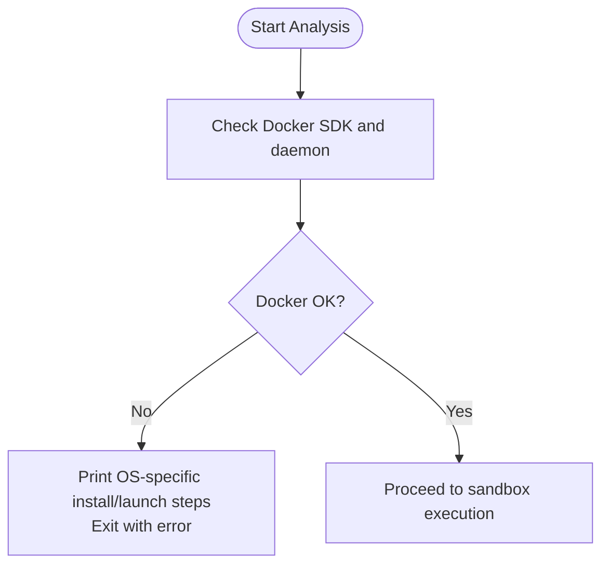

**Diagram sources**
- [cli.py](file://cli.py)
- [sandbox/sandbox.py](file://sandbox/sandbox.py)
- [mcp/sandbox.py](file://mcp/sandbox.py)

**Section sources**
- [cli.py](file://cli.py)
- [sandbox/sandbox.py](file://sandbox/sandbox.py)
- [mcp/sandbox.py](file://mcp/sandbox.py)

### Sandbox Execution and Timeouts
- Pip and npm targets run with network dropped prior to installation.
- DMG and EXE targets use specialized scripts with tailored timeouts and resource monitoring.
- EXE analysis applies a 30-second timeout and filters wine initialization noise from strace logs.
- On timeout or non-zero exit codes, diagnostics are printed and empty logs are treated as failures.

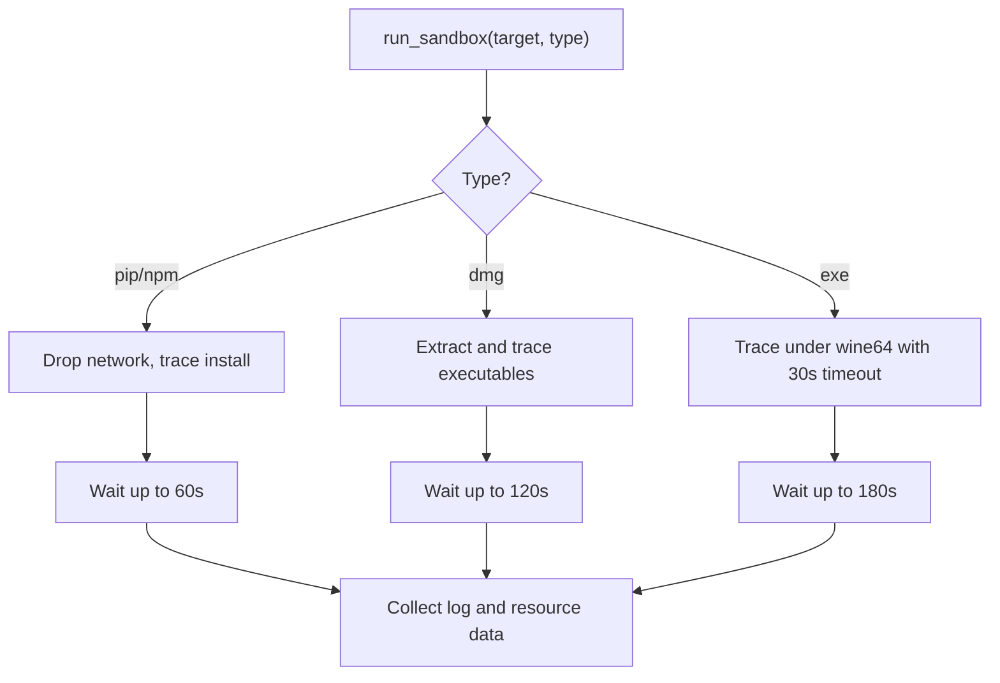

**Diagram sources**
- [sandbox/sandbox.py](file://sandbox/sandbox.py)

**Section sources**
- [sandbox/sandbox.py](file://sandbox/sandbox.py)

### Strace Parsing and Event Extraction
- The parser reconstructs multi-line strace entries, normalizes pid and timestamp formats, and assigns severity weights.
- It classifies network destinations, flags sensitive file accesses, and detects suspicious syscall chains.
- Parser errors are surfaced to the CLI, which aborts the pipeline gracefully.

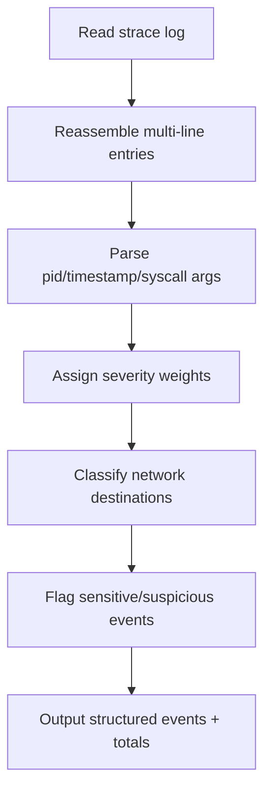

**Diagram sources**
- [monitor/parser.py](file://monitor/parser.py)

**Section sources**
- [monitor/parser.py](file://monitor/parser.py)

### Signature Matching and Temporal Analysis
- Signatures are loaded from a JSON catalog and matched against parsed events using ordered or unordered logic.
- Temporal patterns require timestamped logs and are computed from the event stream.
- Both components are best-effort and do not block the pipeline on failure.

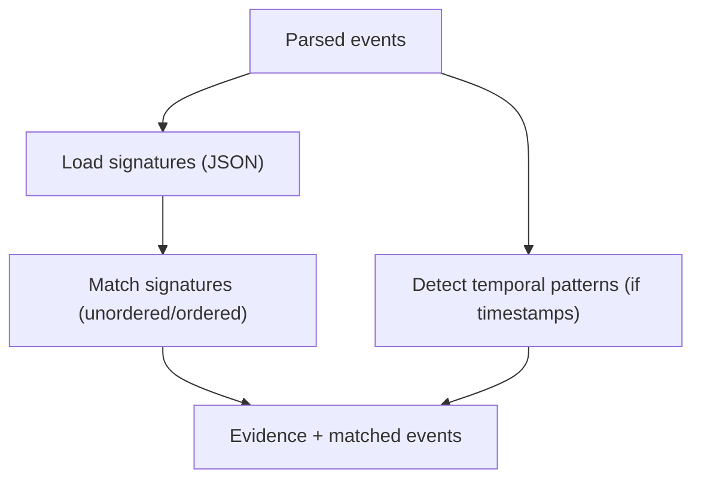

**Diagram sources**
- [monitor/signatures.py](file://monitor/signatures.py)
- [data/signatures.json](file://data/signatures.json)

**Section sources**
- [monitor/signatures.py](file://monitor/signatures.py)
- [data/signatures.json](file://data/signatures.json)

### Graph Construction and Severity Tagging
- The graph builder creates nodes for processes, files, and network destinations.
- Edges are labeled with syscall types and severity; temporal edges connect consecutive events within a fixed window.
- Graph statistics include counts and severity aggregates used by the ML detector.

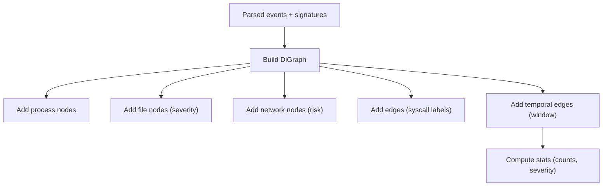

**Diagram sources**
- [graph/builder.py](file://graph/builder.py)

**Section sources**
- [graph/builder.py](file://graph/builder.py)

### Machine Learning Detection and Severity Boosting
- The detector extracts a fixed-size feature vector from the graph and parsed data.
- It uses a supervised model if available; otherwise, it falls back to an unsupervised baseline.
- Severity thresholds and temporal pattern counts boost confidence independently of the model’s prediction.

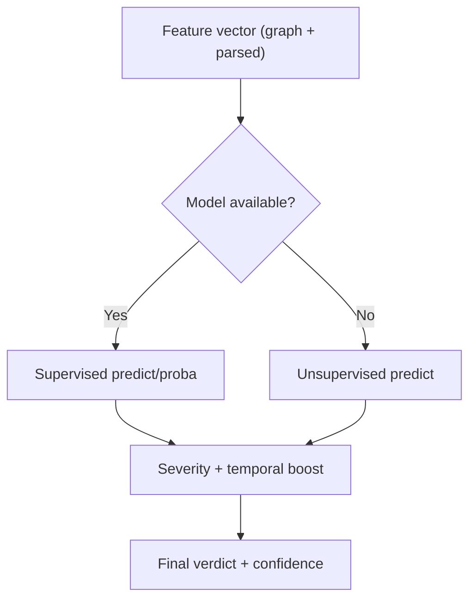

**Diagram sources**
- [ml/detector.py](file://ml/detector.py)

**Section sources**
- [ml/detector.py](file://ml/detector.py)

### MCP Sandbox and Transport Orchestration
- The MCP sandbox builds and runs a containerized server with strace instrumentation.
- It supports stdio and HTTP transports, configurable ports, and timeouts.
- It extracts strace logs and server metadata for downstream analysis.

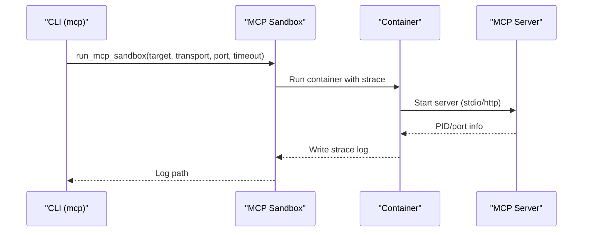

**Diagram sources**
- [mcp/sandbox.py](file://mcp/sandbox.py)

**Section sources**
- [mcp/sandbox.py](file://mcp/sandbox.py)

### Watcher and Continuous Monitoring
- The watcher monitors a repository directory, discovers package manifests, and runs sandbox analyses.
- It streams results via a queue and exposes status snapshots.
- It handles timeouts and errors gracefully, logging diagnostic information.

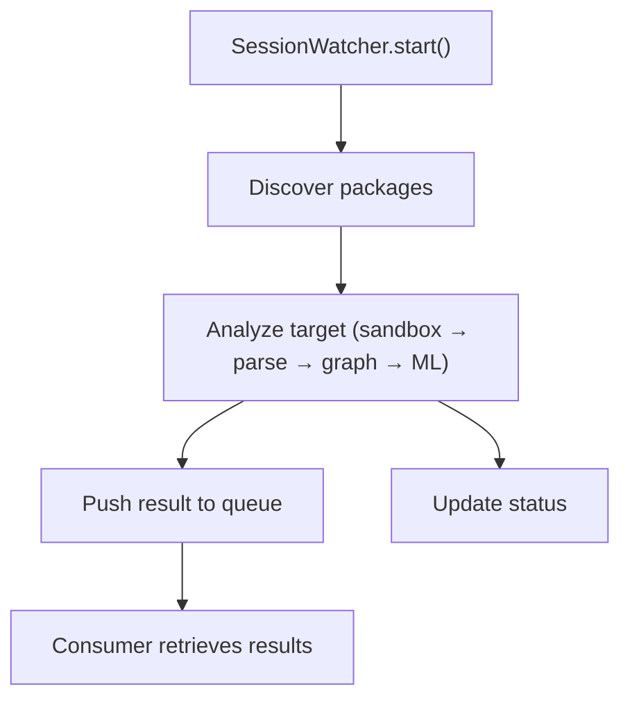

**Diagram sources**
- [watcher/session.py](file://watcher/session.py)

**Section sources**
- [watcher/session.py](file://watcher/session.py)

### Shell Hook Installation
- The installer detects the user’s shell, copies the hook script, and appends a source line to the appropriate RC file.
- It reports success or provides manual installation guidance.

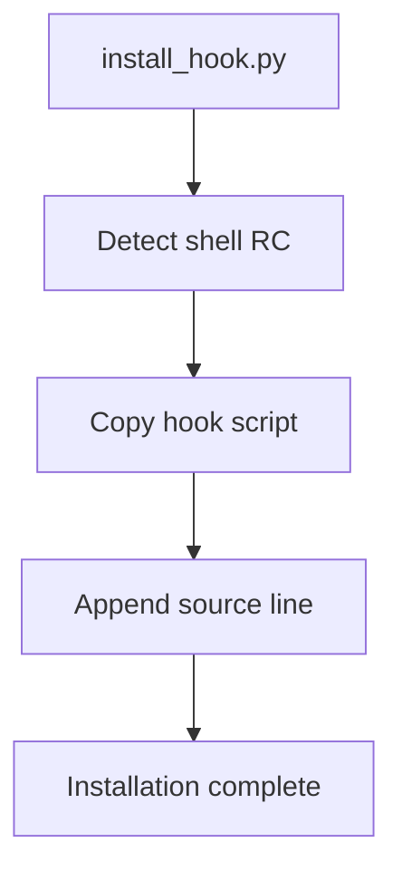

**Diagram sources**
- [hooks/install_hook.py](file://hooks/install_hook.py)

**Section sources**
- [hooks/install_hook.py](file://hooks/install_hook.py)

## Dependency Analysis
External dependencies and their roles:
- Docker SDK: orchestration of sandbox containers.
- NetworkX: graph construction and analysis.
- scikit-learn: supervised and unsupervised ML models.
- google-cloud-storage: model downloads.
- requests: MCP client HTTP verification and JSON-RPC calls.
- rich: CLI output formatting and progress reporting.

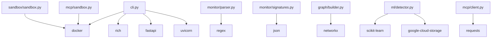

**Diagram sources**
- [pyproject.toml](file://pyproject.toml)
- [cli.py](file://cli.py)
- [sandbox/sandbox.py](file://sandbox/sandbox.py)
- [mcp/sandbox.py](file://mcp/sandbox.py)
- [monitor/parser.py](file://monitor/parser.py)
- [monitor/signatures.py](file://monitor/signatures.py)
- [graph/builder.py](file://graph/builder.py)
- [ml/detector.py](file://ml/detector.py)

**Section sources**
- [pyproject.toml](file://pyproject.toml)

## Performance Considerations
- Reduce overhead by limiting strace verbosity where feasible (the pipeline uses targeted tracing flags).
- Optimize resource usage by ensuring adequate Docker host resources and avoiding unnecessary network access.
- For slow analysis runs:
  - Confirm Docker daemon health and image caching.
  - Use smaller target sets for iterative testing.
  - Monitor container resource usage appended to logs.
- Memory usage:
  - The sandbox records peak memory and disk usage; review these metrics to identify heavy installs.
- Model performance:
  - Prefer supervised models when available; otherwise rely on the unsupervised baseline.
  - Increase training data and consider retraining to improve accuracy.

[No sources needed since this section provides general guidance]

## Troubleshooting Guide

### Docker Connectivity Issues
Symptoms:
- Immediate preflight failure indicating Docker SDK not installed or daemon unreachable.
- Sandbox build or run failures with Docker-related error messages.

Actions:
- Verify Docker is installed and the daemon is running.
- Reinstall Docker if necessary (platform-specific instructions are printed by the CLI).
- Ensure the user has permissions to interact with the Docker daemon.
- Confirm the sandbox image exists or allow the CLI to build it automatically.

**Section sources**
- [cli.py](file://cli.py)
- [sandbox/sandbox.py](file://sandbox/sandbox.py)
- [mcp/sandbox.py](file://mcp/sandbox.py)
- [sandbox/Dockerfile](file://sandbox/Dockerfile)

### Permission Errors
Symptoms:
- Sandbox container exits with non-zero status for DMG/EXE targets.
- Errors indicating missing tools or insufficient privileges.

Actions:
- Confirm the sandbox image includes required tools (strace, wine64, p7zip-full, etc.).
- Review container logs for stderr output and fix underlying causes (missing dependencies, unsupported formats).
- Ensure the host Docker environment allows mounting and capabilities as configured.

**Section sources**
- [sandbox/sandbox.py](file://sandbox/sandbox.py)
- [sandbox/Dockerfile](file://sandbox/Dockerfile)

### Sandbox Execution Failures
Symptoms:
- Empty or minimal strace logs.
- Immediate termination or timeouts.

Actions:
- For EXE targets, note the 30-second timeout and lack of interactive input support.
- For DMG targets, verify extraction succeeded and executables were found.
- Inspect the generated log file for special markers indicating failure modes.
- Increase timeouts cautiously for heavy targets and re-run with verbose diagnostics.

**Section sources**
- [sandbox/sandbox.py](file://sandbox/sandbox.py)

### Analysis Timeouts
Symptoms:
- Timeout messages during sandbox execution.
- Pipeline proceeds despite timeout with partial results.

Actions:
- For EXE targets, the timeout is intentional; consider alternative analysis strategies.
- For DMG targets, ensure the extraction process completes and executables are traceable.
- Investigate heavy installs or network-dependent operations that may prolong execution.

**Section sources**
- [sandbox/sandbox.py](file://sandbox/sandbox.py)

### Strace Parsing Errors
Symptoms:
- Parser warnings or empty event sets.
- Unexpected or malformed syscall lines.

Actions:
- Validate that strace logs contain expected entries and timestamps.
- Confirm the log path exists and is readable.
- Review parser logic for multi-line reassembly and timestamp handling.

**Section sources**
- [monitor/parser.py](file://monitor/parser.py)

### Signature Matching Failures
Symptoms:
- No signatures matched or JSON parsing errors.
- Missing or corrupted signature definitions.

Actions:
- Verify the signatures JSON file exists and is valid.
- Ensure required fields are present for each signature.
- Confirm the event types and targets align with signature rules.

**Section sources**
- [monitor/signatures.py](file://monitor/signatures.py)
- [data/signatures.json](file://data/signatures.json)

### Machine Learning Model Issues
Symptoms:
- Model load failures or GCS download errors.
- Unstable or low-confidence results.

Actions:
- Check local model availability and integrity.
- Attempt to update the model from GCS if needed.
- Fall back to the unsupervised baseline when supervised models are unavailable.

**Section sources**
- [ml/detector.py](file://ml/detector.py)

### MCP Transport and Injection Concerns
Symptoms:
- Transport misconfiguration or HTTP endpoint unreachable.
- Command injection attempts in logs.

Actions:
- Validate transport selection (stdio vs http) and port settings.
- Confirm HTTP endpoints respond appropriately.
- Review command construction and quoting to mitigate injection risks.

**Section sources**
- [mcp/sandbox.py](file://mcp/sandbox.py)
- [tests/mcp/test_sandbox_injection.py](file://tests/mcp/test_sandbox_injection.py)

### Watcher and Continuous Monitoring Problems
Symptoms:
- No packages discovered or analysis not triggered.
- Errors thrown during pipeline execution.

Actions:
- Confirm repository paths and manifest files exist.
- Check watcher status and result queue consumption.
- Review logging output for detailed error messages.

**Section sources**
- [watcher/session.py](file://watcher/session.py)

### Shell Hook Installation Issues
Symptoms:
- Hook not activated after installation.
- Incorrect shell detection or missing RC file.

Actions:
- Re-run the installer and follow printed instructions.
- Manually source the hook script in the detected RC file.
- Verify the copied hook script has proper permissions.

**Section sources**
- [hooks/install_hook.py](file://hooks/install_hook.py)

## FAQ

### What target types are supported?
- PyPI packages, npm packages, DMG images, and Windows EXE files are supported. DMG extraction may vary by format; EXE analysis runs under wine64 with a 30-second timeout.

**Section sources**
- [README.md](file://README.md)

### How accurate is behavioral detection?
- Accuracy depends on the model quality and training data. The supervised model is preferred; otherwise, an unsupervised baseline is used. For improved accuracy, train on larger, labeled datasets.

**Section sources**
- [ml/detector.py](file://ml/detector.py)
- [README.md](file://README.md)

### Why do some Windows or macOS behaviors not appear?
- Wine translation and containerization limit visibility into native syscalls. GUI applications that wait for user input may timeout.

**Section sources**
- [README.md](file://README.md)

### How are signatures defined and matched?
- Signatures are defined in a JSON catalog with ordered and unordered patterns. Matching considers syscall presence, file/network conditions, and sequence constraints.

**Section sources**
- [monitor/signatures.py](file://monitor/signatures.py)
- [data/signatures.json](file://data/signatures.json)

### How are temporal patterns detected?
- Temporal patterns require timestamped logs. They analyze time windows between related events to detect suspicious sequences.

**Section sources**
- [monitor/parser.py](file://monitor/parser.py)

### How can I interpret the final verdict?
- The verdict combines ML predictions with severity scoring and temporal evidence. Severity thresholds and temporal counts can boost confidence independently of the model.

**Section sources**
- [ml/detector.py](file://ml/detector.py)

### How do I integrate TraceTree into my workflow?
- Use the CLI for on-demand analysis, bulk scans, and MCP server security analysis. The watcher module supports continuous monitoring of repositories.

**Section sources**
- [README.md](file://README.md)
- [watcher/session.py](file://watcher/session.py)

### What should I do if I encounter persistent issues?
- Collect logs from each stage, confirm Docker connectivity, validate signatures and model availability, and escalate by opening an issue with detailed logs and reproduction steps.

**Section sources**
- [cli.py](file://cli.py)
- [sandbox/sandbox.py](file://sandbox/sandbox.py)
- [monitor/parser.py](file://monitor/parser.py)
- [ml/detector.py](file://ml/detector.py)

## Conclusion
This guide consolidates practical troubleshooting steps, diagnostic procedures, and performance tips for TraceTree. By validating Docker connectivity, inspecting sandbox logs, understanding parser and model behavior, and leveraging the watcher and MCP modules, most issues can be resolved efficiently. For persistent or complex scenarios, collect comprehensive logs and escalate with reproducible steps.