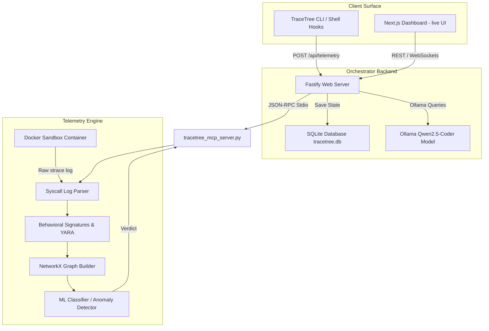
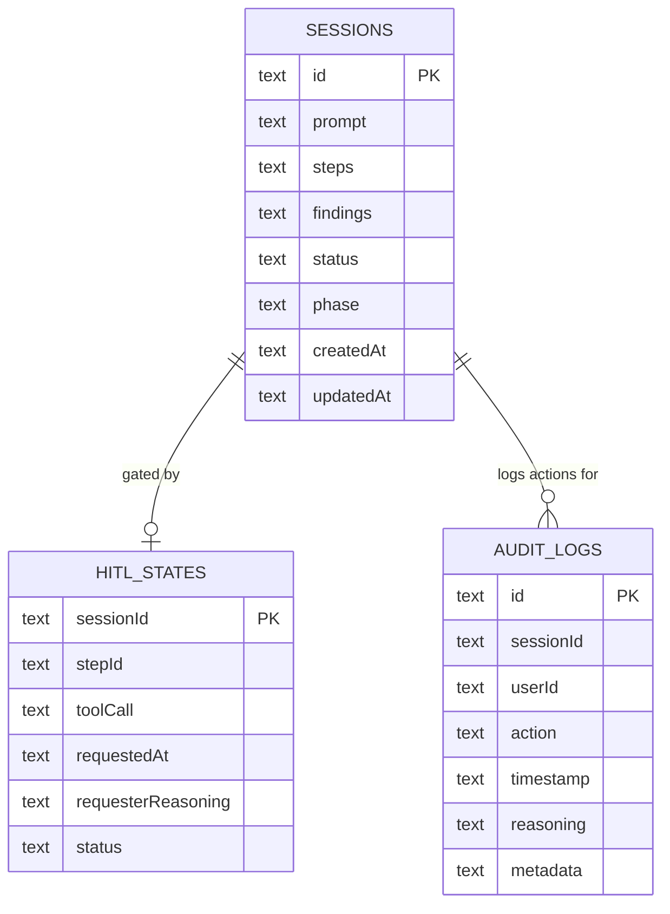

# TraceTree: Unified Master Codebase Analysis & Architecture Manual

This document provides a comprehensive "brain dump" and architectural blueprint of **TraceTree** (cascade-analyzer). It serves as a self-contained technical manual for developers, security architects, and AI agents to implement features, fix bugs, and refactor the system safely.

---

## 1. High-Level Overview

### 1.1 Purpose, Domain & Target Users
TraceTree is a distributed, autonomous runtime security forensics organism built for the modern agentic era. 
- **Domain:** Runtime Behavior Analysis, Application Sandbox Containment, Machine Learning Threat Detection, and Model Context Protocol (MCP) Security.
- **Target Users:** DevSecOps Engineers, Security Analysts, and AI Agent platforms.
- **Core Function:** TraceTree executes untrusted packages (PyPI, npm), binaries (EXE, DMG), and MCP servers in isolated, network-dropped Docker containers, intercepts their system calls (syscalls) using `strace`, processes these event streams into NetworkX directed graphs, and predicts malicious intent (such as typosquatting, credential harvesting, reverse shells, or container escapes) using an optimized Machine Learning (ML) Random Forest pipeline reinforced by local LLMs (Qwen-Coder).

### 1.2 Unified Monorepo Architecture
TraceTree is structured as a unified monorepo containing three principal layers and one standalone sibling sub-project:



### 1.3 Business Purpose of Key Features
1. **Sandbox Isolation (Leg 1):** Safely triggers untrusted installation and execution steps within restricted bounds to protect host development environments.
2. **Syscall Sensing (Leg 2):** Parses the low-level interaction between software and the Linux kernel, capturing the definitive truth of what a process did.
3. **Behavioral Graphing (Leg 3):** Generates directed interaction graphs of processes, files, and network nodes to identify cascading access patterns.
4. **ML Anomaly Detection (Leg 4):** Uses statistical anomaly modeling to detect zero-day or novel malware profiles that do not match static signatures.
5. **YARA & Behavioral Signature Matching (Leg 5):** Leverages industry-standard heuristics to instantly flag known shell scripts, miners, and escape kits.
6. **MCP Security Protocol (Leg 6):** Proactively audits and scans Model Context Protocol tools for injection vulnerabilities, shielding AI agents from hijacking.
7. **Security Guardian (Leg 7):** Static analysis shell hooks that inspect developer environments for secrets or suspicious logging to stop leaks before they occur.
8. **Temporal rhythm analyzer (Leg 8):** Correlates sequence events over millisecond intervals to detect dropper patterns and rapid scanning behaviors.

---

## 2. System Architecture Deep Dive

### 2.1 Complete System Data Flow
The sequence of a complete package behavioral analysis runs through the following pipeline:

```mermaid
sequenceDiagram
    participant User/CLI as CLI / Git Hook
    participant Server as Orchestrator Server (Fastify)
    participant Sandbox as Docker Sandbox (Python)
    participant Parser as Syscall Parser
    participant Graph as NetworkX Graph Builder
    participant ML as ML Detector
    participant Ollama as Ollama (Local AI)
    participant DB as SQLite Store

    User/CLI->>Sandbox: Trigger run_sandbox(package, target_type)
    Note over Sandbox: Pull package; Disable network (eth0 down); Execute payload under strace
    Sandbox-->>Parser: Output strace.log + resources.json
    Parser->>Parser: parse_strace_log() -> Severity weights & categories
    Parser-->>Graph: Parsed event list
    Graph->>Graph: build_cascade_graph() -> Cytoscape nodes/edges + stats
    Graph-->>ML: Feature vector
    ML->>ML: detect_anomaly() -> RandomForest / IsolationForest verdict
    ML->>Server: Verdict + Graph + Flags
    Server->>Ollama: POST /api/generate (Summarize findings in 1 paragraph)
    Ollama-->>Server: Sanitized AI Summary
    Server->>DB: INSERT into sessions & audit_logs
    Server->>User/CLI: Live broadcast (WS: step_completed) -> Render UI
```

### 2.2 Shared Collaborator State & WebSockets
- **WebSocket Gateway:** Exposed via `/ws/live` on the Fastify server. It broadcasts real-time telemetry from active analyses to all connected clients.
- **Client Synchronization:** The frontend listens for events (`investigation_started`, `step_started`, `step_completed`, `ai_summary_started`, `ai_summary_completed`, `hitl_required`, `hitl_resolved`) and dynamically synchronizes its timeline views.
- **Collaborative Interaction:** Multiple analysts can view the same incident feed simultaneously. If a Human-in-the-Loop (HITL) prompt is triggered, any administrator can resolve the state, which instantly updates the view for all other analysts.

### 2.3 Cross-Cutting Concerns
- **Security & Sandboxing:** Network access is dropped inside sandbox containers using `ip link set eth0 down` BEFORE executing untrusted install scripts. Processes are constrained by `mem_limit="512m"`, `cpu_quota=25000` (25% CPU), and `pids_limit=100` to prevent denial-of-service (DoS) attacks on the host. Paths mapped into the sandbox are checked strictly to avoid path traversal.
- **RBAC Gating:** Destructive steps (e.g. host isolation or credential revocation) require `role === 'ADMINISTRATOR'` for HITL approvals.
- **Database Persistence:** Centralized SQLite storage tracks all history, active sessions, and admin audit trails.

---

## 3. Feature-by-Feature Analysis

### 3.1 Sandbox Isolation (Leg 1)
- **Path Reference:** `[[F:sandbox/sandbox.py#L184-L505#2fcc5de2]]`
- **Purpose:** Executes untrusted installers/payloads inside a restricted Docker environment.
- **Execution Mechanism:** 
  1. Inspects the file type (`pip`, `npm`, `dmg`, `exe`, or `shell`).
  2. Spawns `cascade-sandbox:latest` (built from `sandbox/Dockerfile`).
  3. Maps targets inside the container (read-only where appropriate).
  4. Runs a payload preparation phase (e.g., `pip download`), drops container network interface (`eth0`), and runs the installation under `strace -f -t -e trace=all`.
  5. Monitors CPU/Memory usage, capturing peak resources in `/tmp/resources.json`.
  6. Copies out `/tmp/strace.log` and `/tmp/resources.json` to the host's `logs/` directory before destroying the container.
- **Edge Cases & Limitations:** Wine64 EXE translation maps Windows API calls to Linux syscalls, meaning Windows registry changes or COM interactions may not be captured. DMG files extract their contents using 7z, but since they execute in a Linux-slim image, macOS-specific APIs (e.g., Keychain) will fail to run.

### 3.2 Syscall Parsing (Leg 2)
- **Path Reference:** `[[F:monitor/parser.py#L358-L777#28148]]`
- **Purpose:** Translates verbose multi-line strace logs into structured event sequences.
- **Execution Mechanism:**
  1. Merges multi-line syscalls (lines interrupted by strace long-arg wrappers) back into single logical rows.
  2. Applies regular expressions to extract PIDs, timestamps, syscall names, arguments, and return values.
  3. Classifies network connections (standard ports vs C2 ports like 4444/1337) and file paths.
  4. Assigns base severity weights (0.0 to 10.0) based on known risk levels (e.g., `init_module` = 10, `memfd_create` = 9, `execve` = 5).
  5. Detects critical sequences, such as a child process spawning followed by sensitive file reads and outgoing network calls.
- **Hidden Dependencies:** Relies on the strace logging tool utilizing the `-t` (timestamps) and `-f` (follow forks) arguments.

### 3.3 Behavioral Graphing (Leg 3)
- **Path Reference:** `[[F:graph/builder.py#L8-L208#8689]]`
- **Purpose:** Contextualizes process relationships by building directed causality graphs.
- **Execution Mechanism:**
  1. Spawns NetworkX nodes for each unique process, file path, and network socket.
  2. Adds edges representing process ancestry (clone/fork relationships) and operational calls (openat, connect).
  3. Embeds temporal links (edges showing sequential operations under the same PID within a 5-second window).
  4. Calculates topological metrics (degree centrality and betweenness centrality) to locate "bridge" nodes (e.g., a script executing code reflection).
  5. Outputs Cytoscape-compatible JSON maps for web dashboard visualization.

### 3.4 ML Anomaly Detection (Leg 4)
- **Path Reference:** `[[F:ml/detector.py#L257-L330#12962]]`
- **Purpose:** Detects novel or obfuscated threat vectors using structural features of the runtime graph.
- **Execution Mechanism:**
  1. Extracts a 10-feature vector representing node count, edge count, network connections, file reads, execution counts, severity metrics, and temporal counts.
  2. Passes the vector to a trained RandomForest model (`ml/model.pkl`).
  3. If no trained model is available locally, it pulls it from a public GCS bucket (`cascade-analyzer-models`).
  4. Falls back to an IsolationForest trained on 10 hardcoded clean baseline package configurations.
  5. Adjusts the model's confidence rating using dynamic boosters: +15% per temporal pattern match, and overrides to malicious if total severity exceeds `30.0`.

### 3.5 YARA & Signature Matching (Leg 5)
- **Path Reference:** `[[F:monitor/signatures.py#L86-L236#16731]]` & `[[F:monitor/yara.py#L151-L201#13215]]`
- **Purpose:** Searches files and system call logs for known exploit code and shell interactions.
- **Execution Mechanism:**
  1. Compiles embedded YARA rules (e.g., checking for obfuscated base64 payloads, cryptominers, reverse shells, and container escape markers).
  2. Evaluates the files against rules using `yara-python` or falls back to a custom regex stream analyzer if the C-library is missing.
  3. Leverages `monitor/signatures.py` to match event sequences against JSON signatures (e.g., typosquat exfiltration requires a secret read followed by an outbound Pastebin socket connection).

### 3.6 MCP Server Security Analysis (Leg 6)
- **Path Reference:** `[[F:mcp/client.py#L78-L185#16050]]` & `[[F:mcp/classifier.py#L61-L96#9158]]`
- **Purpose:** Tests AI tools (Model Context Protocol servers) for injection and exfiltration vulnerabilities.
- **Execution Mechanism:**
  1. Runs the server in a sandbox container.
  2. Simulates an MCP client, completing the JSON-RPC handshake and discovering all exposed tools.
  3. Generates safe arguments based on parameter schemas to test default tool behavior.
  4. Re-invokes tools injecting malicious probes (`; ls /etc`, path traversals, XSS scripts).
  5. Extracts features mapping process spawns or network calls during tool invocation.
  6. Compares observations against predefined baselines for filesystem, github, database, fetch, or shell servers.

### 3.7 AI Security Guardian (Leg 7)
- **Path Reference:** `[[F:monitor/scanner.py#L99-L186#11717]]` & `[[F:hooks/install_hook.py#L1-L120#5090]]`
- **Purpose:** Prevents developers from committing API keys or vulnerable log code.
- **Execution Mechanism:**
  1. Installs a shell wrapper hook that intercept `git clone` commands to run background scans.
  2. Scans files for high-entropy secrets (OpenAI, AWS, GitHub tokens).
  3. Scans for print statements executing variable outputs containing keywords like "secret" or "password".
  4. Can run with the `--ai` flag to verify findings contextually using local Ollama instances, filtering out false positives.

### 3.8 Temporal & N-gram Analysis (Leg 8)
- **Path Reference:** `[[F:monitor/timeline.py#L298-L332#13587]]`
- **Purpose:** Analyzes the timing of operations to identify dropper routines.
- **Execution Mechanism:**
  1. Sorts the event stream chronologically.
  2. Searches for a delayed execution pattern (a silent period exceeding 10 seconds followed by a burst of high-severity calls).
  3. Detects rapid file scanning (more than 10 file reads in under a second).
  4. Flags connection-to-shell timing (external network call followed by spawning `/bin/sh` within 3 seconds).

### 3.9 Live Collaborative Dashboard
- **Path Reference:** `[[F:frontend/src/app/page.tsx#L337-L428#20720]]` & `[[F:orchestrator/src/server.ts#L46-L192#219]]`
- **Purpose:** Renders visual representations of incident flows and manages manual authorization requests.
- **Execution Mechanism:**
  1. Next.js connects to the Fastify server using a WebSocket connection (`/ws/live`).
  2. Live incident feeds parse updates from active investigations.
  3. Displays Interactive HITL panels blocking execution when a step is marked `isDestructive`.
  4. Surges Ollama summaries at the top of the interface.

---

## 4. Nuances, Subtleties & Gotchas

> [!IMPORTANT]
> **Things You Must Know Before Changing Code**

1. **The Network Drop Isolation Design:** 
   For `pip` and `npm` package targets, the container network interface is drop-capable. However, to resolve package dependencies, the sandbox must first run a download stage (e.g. `pip download`) WITH the network active, saving packages locally in `/tmp/pkg`. The network is then explicitly dropped (`ip link set eth0 down`) before the actual execution is performed under `strace`. Changing this sequence will either break dependency resolution or let malicious setup scripts make network connections undetected.

2. **The MockSandbox Prototype Trap:**
   `orchestrator/src/utils/mockSandbox.ts` implements a mock JSON-RPC server. It has simulated responses for `logs_query`, `threat_intel`, and `slack_search`. However, this mock is NOT registered in `orchestrator/src/engine/index.ts` by default, meaning custom planners executing these tools will fail outside of explicit demo/test overrides.

3. **Multi-line Strace Buffering:**
   `monitor/parser.py` implements a custom line reassembler (`_reassemble_lines`). It buffers unfinished lines until it matches the standard return signature `) = <result>`. If strace output is interrupted or a process crashes mid-syscall, the buffer is flushed on EOF. Any modifications to this parser must account for timestamped formats (`-t`), PID brackets, and multi-threaded interleaving.

4. **Wine64 Stderr Filtering:**
   During Windows binary execution under wine, stderr is redirected to a temporary file (`/tmp/wine_stderr.log`) and filtered. System calls referencing `/root/.wine`, `/usr/lib/wine`, and standard boot DLL loads are pruned to prevent bloating the feature vector.

---

## 5. Technical Reference & Glossary

### 5.1 Domain Glossary
- **Typosquatting:** Hosting malicious packages with names close to popular libraries (e.g. `urllib33` instead of `urllib3`) hoping developers misspell dependencies.
- **Reverse Shell:** A shell payload that initiates an outbound connection to an attacker's listener, bypassing firewalls.
- **Process Injection:** Spawning a process and changing its execution memory using `mprotect` with write/exec flags.
- **Model Context Protocol (MCP):** An open standard for connecting AI models to data stores and tools.
- **HITL (Human-in-the-Loop):** An execution gate requiring human intervention before a dangerous action can proceed.

### 5.2 SQLite Persistence Schema



### 5.3 Core Backend API Endpoints

#### POST `/api/investigate`
- **Purpose:** Starts an natural language security investigation.
- **Request Body:**
  ```json
  {
    "prompt": "Verify if the package requests is safe to deploy",
    "userId": "usr_9921"
  }
  ```
- **Response:**
  ```json
  {
    "id": "plan_1718873429188",
    "prompt": "Verify if the package requests is safe to deploy",
    "steps": [
      {
        "id": "step-1",
        "title": "Analyze strace log",
        "tool": "analyze_strace",
        "parameters": { "log_path": "/Users/.../logs/requests_pip_strace.log", "pkg_path": "/tmp/pkg" },
        "status": "pending"
      }
    ]
  }
  ```

#### POST `/api/approve`
- **Purpose:** Resolves a Human-in-the-Loop authorization step.
- **Request Body:**
  ```json
  {
    "sessionId": "plan_1718873429188",
    "approved": true,
    "reasoning": "Confirmed this is clean maintenance code",
    "userId": "usr_9921",
    "role": "ADMINISTRATOR"
  }
  ```
- **Response:** Returns the updated investigation summary.

#### POST `/api/telemetry`
- **Purpose:** Broadcasts events to client sessions and triggers background summaries.

#### WS `/ws/live`
- **Purpose:** Collaborative client session updates.

---

## Appendix A: State Block

```json
{
  "INDEX_VERSION": "1.0.4",
  "FILE_MAP_SUMMARY": {
    "cli.py": "CLI Entry point and pipeline orchestrator",
    "tracetree_mcp_server.py": "Stdio JSON-RPC MCP Server wrapper",
    "sandbox/sandbox.py": "Docker sandbox execution manager",
    "monitor/parser.py": "Regex strace log parser",
    "monitor/signatures.py": "Behavioral signature matcher",
    "monitor/timeline.py": "Temporal pattern analyzer",
    "monitor/yara.py": "YARA/Regex file content scanner",
    "graph/builder.py": "NetworkX directed graph builder",
    "ml/detector.py": "Random Forest / Isolation Forest classifier",
    "ml/trainer.py": "Parallel model training script",
    "mcp/client.py": "MCP client simulator and adversarial fuzzer",
    "mcp/features.py": "MCP syscall feature extractor",
    "mcp/classifier.py": "MCP threat classifier",
    "orchestrator/src/server.ts": "Orchestrator web server",
    "orchestrator/src/engine/index.ts": "TypeScript investigation engine",
    "frontend/src/app/page.tsx": "Next.js dashboard page"
  },
  "OPEN_QUESTIONS": [
    "How should we handle dynamic remote git cloning inside SessionWatcher?",
    "Should we support native Windows/macOS syscall tracing in the future?"
  ],
  "KNOWN_RISKS": [
    "Wine64 EXE syscall mapping is incomplete (some Windows behavior is missed)",
    "Ollama local instance latency can delay live summaries during peak system loads"
  ],
  "GLOSSARY_DELTA": {
    "MCP Router": "TypeScript class routing execution requests to registered stdio servers",
    "Nervous System": "The component mapping of strace outputs to semantic behaviors"
  }
}
```

---

## Appendix B: File Index

Below are the key files that form the core components of the TraceTree monorepo, scored by priority:

| (#) | PRIORITY | PATH | TYPE | LINES | HASH8 | NOTES |
|---|---|---|---|---|---|---|
| 1 | HIGH | `cli.py` | Python | 1776 | `fcf6004b` | Main Typer CLI entry point |
| 2 | HIGH | `tracetree_mcp_server.py` | Python | 163 | `96f14ea8` | Native stdio MCP server wrapping engine |
| 3 | HIGH | `sandbox/sandbox.py` | Python | 545 | `2fcc5de2` | Container sandbox runner and resource manager |
| 4 | HIGH | `sandbox/Dockerfile` | Asset/Other | 11 | `0d436468` | Docker sandbox image specification |
| 5 | HIGH | `sandbox/deny.json` | JSON | 20 | `d814ce24` | Sandbox seccomp profile |
| 6 | HIGH | `monitor/parser.py` | Python | 777 | `28148` | Syscall sequence parser and weight metrics |
| 7 | HIGH | `monitor/signatures.py` | Python | 488 | `16731` | JSON signature sequence evaluator |
| 8 | HIGH | `monitor/timeline.py` | Python | 353 | `13587` | Temporal dropper anomaly detector |
| 9 | HIGH | `monitor/yara.py` | Python | 381 | `13215` | Yara compiler and regex-fallback engine |
| 10 | HIGH | `monitor/scanner.py` | Python | 266 | `11717` | Local secret scanner and agent auditor |
| 11 | HIGH | `monitor/ai_analyzer.py` | Python | 200 | `e1b2f4a2` | Local LLM contextual assistant |
| 12 | HIGH | `graph/builder.py` | Python | 208 | `8689` | NetworkX Cytoscape graph generator |
| 13 | HIGH | `ml/detector.py` | Python | 330 | `12962` | Anomaly classifier & severity booster |
| 14 | HIGH | `ml/trainer.py` | Python | 115 | `4648` | Parallel dataset classifier model trainer |
| 15 | HIGH | `mcp/client.py` | Python | 473 | `16050` | JSON-RPC Client and adversarial fuzzer |
| 16 | HIGH | `mcp/features.py` | Python | 473 | `16621` | Tool call event extractor |
| 17 | HIGH | `mcp/classifier.py` | Python | 268 | `9158` | MCP threat classification rules |
| 18 | HIGH | `mcp/sandbox.py` | Python | 327 | `10675` | MCP-specific server sandboxing manager |
| 19 | HIGH | `orchestrator/src/server.ts` | TypeScript | 219 | `219` | Orchestrator Web Server |
| 20 | HIGH | `orchestrator/src/engine/index.ts` | TypeScript | 176 | `176` | Main execution loop coordinator |
| 21 | HIGH | `orchestrator/src/store/index.ts` | TypeScript | 129 | `129` | Session SQLite persistence layer |
| 22 | HIGH | `orchestrator/src/planner/index.ts` | TypeScript | 124 | `124` | AI-native investigation planner |
| 23 | HIGH | `orchestrator/src/mcp/index.ts` | TypeScript | 155 | `155` | Stdio MCP Router Client |
| 24 | HIGH | `frontend/src/app/page.tsx` | TypeScript | 429 | `20720` | Collaborative dashboard layout |
| 25 | HIGH | `frontend/src/components/TelemetryVisualizer.tsx` | TypeScript | 380 | `d6a0b411` | Telemetry visualizer rendering |
| 26 | HIGH | `frontend/src/components/HITLConsole.tsx` | TypeScript | 110 | `b491a92e` | HITL approval control pane |
| 27 | HIGH | `frontend/src/components/IncidentFeed.tsx` | TypeScript | 190 | `fa02e9bc` | Live WS feed event component |
| 28 | HIGH | `repocheckai/src/application/core/analyzer.ts` | TypeScript | 403 | `12784` | RepoCheckAI health scan coordinator |
